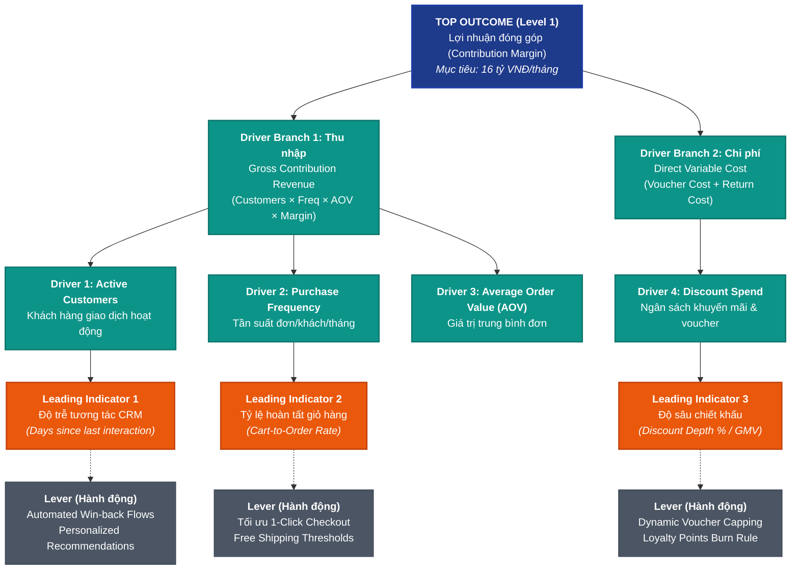
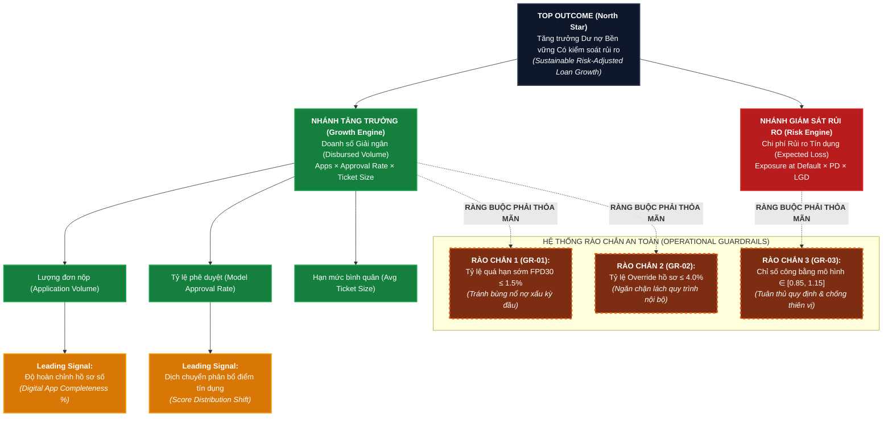

# BÁO CÁO BÀI TẬP TUẦN 3: XÂY DỰNG VÀ QUẢN TRỊ CÂY CHỈ SỐ HIỆU SUẤT (KPI TREE)
**Học phần:** Phân tích Kinh doanh (Introduction to Business Analytics)  
**Đơn vị:** Đại học Bách Khoa Hà Nội (HUST)  
**Tài liệu tham khảo nền tảng:** *Chapter 2 - Section 2.3: KPI Tree (Structure · Drivers · Leading indicators · Worked examples)*  
**Người thực hiện:** Sinh viên / Nhóm học viên  
**Ngày hoàn thành:** 24/09/2026  

---

## MỤC LỤC
1. [TỔNG QUAN VÀ KHUNG LÝ THUYẾT NỀN TẢNG (THEORETICAL FOUNDATION)](#1-tổng-quan-và-khung-lý-thuyết-nền-tảng)
2. [EXERCISE A: THIẾT KẾ KPI TREE CHO BÀI TOÁN DOANH NGHIỆP THỰC TẾ](#2-exercise-a-thiết-kế-kpi-tree-cho-bài-toán-doanh-nghiệp-thực-tế)
   - 2.1. Lựa chọn bối cảnh ngành và bài toán kinh doanh
   - 2.2. Phân rã cấu trúc KPI Tree 3 cấp bậc (3-Level Architecture)
   - 2.3. Hệ thống 03 Leading Indicators then chốt và tính dự báo
   - 2.4. Sơ đồ trực quan hóa Cây chỉ số (Mermaid KPI Tree)
   - 2.5. Kiểm định tính khả thi từng Node theo Bộ tiêu chuẩn 5 yếu tố
3. [EXERCISE B: PHÂN TÍCH CHỈ SỐ PHÙ PHIẾM (VANITY METRIC) TRÊN DASHBOARD THỰC TẾ](#3-exercise-b-phân-tích-chỉ-số-phù-phiếm-vanity-metric)
   - 3.1. Nhận diện chỉ số phù phiếm: "Tổng lượt tải ứng dụng tích lũy (Cumulative App Downloads)"
   - 3.2. Vì sao chỉ số này tạo ảo tưởng thành công nhưng bản chất rất yếu kém?
   - 3.3. So sánh đối chiếu: Vanity Metric vs. Actionable Value Metric
   - 3.4. Đề xuất chỉ số thay thế và giải pháp khắc phục
4. [EXERCISE C: PHÂN QUYỀN SỞ HỮU DRIVER VÀ HÀNH ĐỘNG CAN THIỆP CỤ THỂ](#4-exercise-c-phân-quyền-sở-hữu-driver-và-hành-động-can-thiệp)
   - 4.1. Lựa chọn Driver mục tiêu: Tỷ lệ hoàn tất giỏ hàng (Cart Completion Rate)
   - 4.2. Xác định Đội ngũ Chịu trách nhiệm (Accountable Team Ownership)
   - 4.3. Kế hoạch can thiệp khả thi (Actionable Intervention Framework)
   - 4.4. Mô hình phân tích dữ liệu (Analytics Project Linkage)
5. [EXERCISE D: VIẾT LẠI TRƯỜNG HỢP MỤC TIÊU KÉP KÈM RÀO CHẮN BẢO VỆ (GUARDRAILS)](#5-exercise-d-mục-tiêu-kép-kèm-guardrails)
   - 5.1. Bối cảnh xung đột lợi ích cốt lõi: Tăng trưởng giải ngân vs. Rủi ro nợ xấu
   - 5.2. Tái cấu trúc bài toán: Từ mục tiêu xung đột sang Cây chỉ số cân bằng
   - 5.3. Thiết lập hệ thống Rào chắn an toàn (Guardrails) & Ngưỡng kích hoạt
   - 5.4. Sơ đồ KPI Tree tích hợp Guardrails (Mermaid Diagram)
6. [TỔNG KẾT VÀ BÀI HỌC KINH NGHIỆM (KEY TAKEAWAYS)](#6-tổng-kết-và-bài-học-kinh-nghiệm)

---

## 1. TỔNG QUAN VÀ KHUNG LÝ THUYẾT NỀN TẢNG

Theo học liệu *Section 2.3 - KPI Tree (Đại học Bách Khoa Hà Nội)*:
* **Định nghĩa (Definition):** KPI Tree là mô hình phân rã phân cấp từ một mục tiêu kinh doanh cấp cao (*Top-level Business Outcome*) thành các chỉ số dẫn dắt (*Driver Metrics*) và các chỉ số báo trước (*Leading Indicators*) giải thích và tác động trực tiếp lên kết quả đó.
* **Cấu trúc 3 tầng (Three Levels):**
  1. **Level 1 – Outcome KPI (North Star):** Thể hiện kết quả cuối cùng ("What success looks like"). Thường là chỉ số trễ (*Lagging metric*), phản ánh hiệu quả kinh doanh sau khi sự việc đã diễn ra (ví dụ: Doanh thu thuần, Tỷ lệ nợ xấu NPL, Tỷ lệ giữ chân khách hàng 90 ngày).
  2. **Level 2 – Driver Metrics:** Các thành phần toán học hoặc cấu trúc quy trình tạo nên kết quả ("What moves the outcome").
  3. **Level 3 – Leading Indicators:** Các tín hiệu sớm có thể tác động được ("What teams can change / Early signals").
* **5 Giá trị cốt lõi của KPI Tree trong Business Analytics:**
  - **Tập trung (Focus):** Loại bỏ việc theo dõi tràn lan hàng tá số liệu rời rạc, không liên quan.
  - **Chẩn đoán (Diagnosis):** Khi Outcome sụt giảm, lập tức xác định chính xác nhánh nào đang gặp trục trặc.
  - **Tính hành động (Actionability):** Gắn kết chặt chẽ từng chỉ số với đội ngũ sở hữu và các đòn bẩy (*Levers*) can thiệp.
  - **Hỗ trợ định hình bài toán (Framing Support):** Làm rõ tiêu chí thành công khi triển khai dự án dữ liệu theo CRISP-DM.
  - **Thống nhất tổ chức (Alignment):** Tạo ngôn ngữ chung xuyên suốt giữa khối Kinh doanh (*Business*) và khối Phân tích dữ liệu (*Analytics*).

---

## 2. EXERCISE A: THIẾT KẾ KPI TREE CHO BÀI TOÁN DOANH NGHIỆP THỰC TẾ
> **Yêu cầu đề bài:** *Build a KPI tree for your industry case (outcome + drivers + 3 leading indicators).*

### 2.1. Lựa chọn bối cảnh ngành và bài toán kinh doanh
* **Ngành:** Thương mại điện tử B2C & Bán lẻ đa kênh (E-Commerce / Retail Marketplace).
* **Doanh nghiệp mô phỏng:** Nền tảng bán lẻ công nghệ và hàng tiêu dùng trực tuyến (tương tự quy mô Tiki / Shopee Mall / FPT Shop Online).
* **Mục tiêu cấp cao (Top Outcome KPI):** **Lợi nhuận đóng góp ròng hàng tháng (Monthly Net Contribution Margin - CM)**.
  - *Định nghĩa toán học:* $\text{Contribution Margin} = \text{Net Revenue} - \text{Variable Costs}$
  - *Công thức phân rã chi tiết:*
    $$\text{CM} = (\text{Active Buyers} \times \text{Purchase Frequency} \times \text{AOV} \times \text{Gross Margin \%}) - \text{Discount Cost} - \text{Variable Logistics \& Fulfillment Cost}$$
  - *Baseline hiện tại:* $12.5$ tỷ VNĐ/tháng (Tương đương tỷ suất $14.2\%$ trên GMV).
  - *Target quý tiếp theo:* Đạt $16.0$ tỷ VNĐ/tháng (Tỷ suất $16.5\%$ trên GMV) trong vòng 2 quý.

---

### 2.2. Phân rã cấu trúc KPI Tree 3 cấp bậc (3-Level Architecture)

Áp dụng phương pháp phân rã tích hợp **Multiplicative Pattern** (Tích số) và **Funnel Stages** (Phễu chuyển đổi) theo Slide 10:

```
Level 1: Top Outcome KPI
   └── Lợi nhuận đóng góp hàng tháng (Net Contribution Margin)
        ├── [Branch A - Thu nhập gộp]: Tổng doanh thu gộp sinh lời (Gross Contribution)
        │    ├── Driver A1: Cơ sở khách hàng giao dịch (Active Transacting Customers)
        │    │    ├── Sub-driver: Khách hàng mới kích hoạt (New Activated Users)
        │    │    └── Sub-driver: Khách hàng cũ quay lại (Retained / Repeat Customers)
        │    ├── Driver A2: Tần suất mua hàng trung bình / tháng (Order Frequency)
        │    ├── Driver A3: Giá trị đơn hàng trung bình (Average Order Value - AOV)
        │    └── Driver A4: Tỷ suất lợi nhuận gộp danh mục (Category Gross Margin %)
        │
        └── [Branch B - Chi phí biến đổi]: Tổng chi phí biến đổi trực tiếp (Direct Variable Costs)
             ├── Driver B1: Tổng chi phí khuyến mãi & Voucher (Discount & Promotion Spend)
             └── Driver B2: Chi phí xử lý & Giao vận đơn hàng thất bại (Return & Failed Delivery Cost)
```

---

### 2.3. Hệ thống 03 Leading Indicators then chốt và tính dự báo

Theo Slide 7 & Slide 23 của bài giảng, Leading Indicators phải là các tín hiệu hành vi đi trước (*early signals*), có khả năng đo lường định kỳ ngắn ngày (hàng ngày/tuần) và có liên kết nguyên nhân - kết quả rõ ràng (*proven causal link*) với các Drivers:

| STT | Leading Indicator (Chỉ số báo trước) | Công thức & Nguồn dữ liệu | Chu kỳ theo dõi | Driver trực tiếp tác động | Cơ chế dự báo nguyên nhân - kết quả (Causal Linkage) |
| :---: | :--- | :--- | :---: | :--- | :--- |
| **1** | **Tỷ lệ hoàn tất giỏ hàng (Cart-to-Order Completion Rate)** | $\frac{\text{Số session đặt hàng thành công}}{\text{Số session có hành vi thêm vào giỏ}} \times 100\%$<br>*(Nguồn: Event Clickstream / Web & App Analytics)* | Hàng ngày (Daily) | **Driver A2 (Tần suất mua hàng) & Driver A1** | Khi tỷ lệ bỏ rơi giỏ hàng (*Cart Abandonment*) tăng đột biến trong 48 giờ, tần suất mua sắm và GMV của tuần đó sẽ sụt giảm ngay lập tức. Đây là chỉ số phản ánh ma sát thanh toán, phí ship bất ngờ hoặc lỗi coupon. |
| **2** | **Độ trễ phản hồi chiến dịch CRM (Campaign Response Lag / Inactivity Days)** | $\text{Số ngày trung bình từ lần mua cuối đến lần tương tác tiếp theo}$<br>*(Nguồn: CDP / CRM Event Log)* | Hàng tuần (Weekly) | **Driver A1 (Khách hàng quay lại - Repeat Buyers)** | Nếu thời gian không mở app hoặc không tương tác qua push notification vượt quá ngưỡng chuẩn (P75 = 21 ngày), xác suất khách hàng rời bỏ (*Churn Probability*) trong 60 ngày tới tăng vọt lên 78%. Can thiệp sớm ở ngày thứ 14 sẽ giữ chân được tệp này. |
| **3** | **Độ sâu chiết khấu trung bình trên mỗi đơn hàng (Average Discount Depth per Order)** | $\frac{\text{Tổng giá trị Voucher \& Giảm giá}}{\text{Tổng Gross Merchandise Value (GMV)}} \times 100\%$<br>*(Nguồn: Transaction DB / Promotion Engine)* | Hàng ngày (Real-time / Daily) | **Driver B1 (Chi phí khuyến mãi) & Driver A4 (Gross Margin %)** | Nếu tỷ lệ giảm giá vượt ngưỡng kế hoạch (ví dụ > 8% GMV) trong các đợt flash-sale, biên lợi nhuận đóng góp sẽ bị xói mòn ngay lập tức trước khi chốt sổ kế toán tháng, giúp đội ngũ Growth kịp thời siết ngân sách trợ giá. |

---

### 2.4. Sơ đồ trực quan hóa Cây chỉ số (Mermaid KPI Tree)



---

### 2.5. Kiểm định tính khả thi từng Node theo Bộ tiêu chuẩn 5 yếu tố

Theo Slide 11 (*Checklist for Each Node*), mọi nhánh trong cây chỉ số trên đều đáp ứng trọn vẹn 5 tiêu chí:
1. **Defined (Định nghĩa rõ ràng):** Từng chỉ số đều có công thức tính toán toán học không mập mờ, xác định rõ nguồn dữ liệu trích xuất (Data Warehouse, Event Logs, Transaction DB).
2. **Owned (Có chủ sở hữu):** Gán trực tiếp trách nhiệm cho các bộ phận chuyên môn cụ thể (Growth Marketing, Product/Tech, Commercial/Merchandising).
3. **Actionable (Có tính hành động):** Mỗi chỉ số đều liên kết trực tiếp với các đòn bẩy (*Levers*) mà đội ngũ có quyền hạn và công cụ để thay đổi.
4. **Timely (Kịp thời):** Các Leading indicators được cập nhật theo giờ hoặc ngày, cho phép can thiệp trước chu kỳ tổng kết tháng.
5. **Linked (Có liên kết nhân quả):** Tồn tại lộ trình định lượng rõ ràng từ sự chuyển dịch của Leading Indicators đến Driver và tác động cuối cùng lên Net Contribution Margin.

---

## 3. EXERCISE B: PHÂN TÍCH CHỈ SỐ PHÙ PHIẾM (VANITY METRIC) TRÊN DASHBOARD THỰC TẾ
> **Yêu cầu đề bài:** *Find one vanity metric in a public dashboard or report and explain why it is weak.*

### 3.1. Nhận diện chỉ số phù phiếm: "Tổng lượt tải ứng dụng tích lũy (Cumulative App Downloads)"
* **Nguồn quan sát thực tế:** Báo cáo tăng trưởng công khai (Public Pitch Decks, Báo cáo Quan hệ Cổ đông IR, Thông cáo báo chí PR) của nhiều nền tảng ứng dụng di động, sàn thương mại điện tử hoặc ứng dụng tài chính tiêu dùng.
* **Hình thức trình bày:** Một biểu đồ đường dốc đứng thể hiện con số ấn tượng: *"Chạm mốc 10.000.000 lượt tải ứng dụng"* hoặc *"Tăng trưởng lượt cài đặt đạt +150% YoY"*.

---

### 3.2. Vì sao chỉ số này tạo ảo tưởng thành công nhưng bản chất rất yếu kém?
Căn cứ theo nguyên lý tại Slide 25 (*Common KPI Tree Mistakes: Vanity metrics - App downloads with no link to retention or revenue*), chỉ số này bộc lộ 4 điểm yếu chí tử:

1. **Là số liệu tích lũy đơn điệu (Monotonically Increasing Nature):**
   - Số lượt tải tích lũy là hàm không giảm theo thời gian ($Downloads_t = Downloads_{t-1} + NewDownloads_t$). Ngay cả khi doanh nghiệp đang mất đi hàng nghìn khách hàng mỗi ngày, con số tổng tải về vẫn luôn đi lên. Nó che đậy hoàn toàn tốc độ đào thải (*Churn Rate*) và sự suy giảm của doanh nghiệp.
2. **Ngắt kết nối hoàn toàn với Giá trị Kinh tế & Doanh thu (Disconnected from Business Value):**
   - Một lượt tải không đồng nghĩa với một người dùng hoạt động (*Active User*), càng không đồng nghĩa với một đơn hàng phát sinh doanh thu. Trên thực tế ngành di động, trung bình $70\% - 80\%$ người dùng xóa ứng dụng hoặc không bao giờ mở lại sau ngày đầu tiên (Day-1 Drop-off). Do đó, 10 triệu lượt tải có thể chỉ đem lại 100.000 người dùng thực sự giao dịch.
3. **Dễ bị thao túng và "game hóa" giả tạo (Easily Gamed via Paid Acquisition):**
   - Đội ngũ tiếp thị có thể đốt tiền chạy các chiến dịch quảng cáo giá rẻ (Incentivized Ads, Click farms, Affiliate thiếu kiểm soát) để kéo hàng trăm nghìn lượt tải ảo nhằm làm đẹp báo cáo. Chi phí này tạo ra lỗ hổng tài chính lớn nhưng không mang lại dòng tiền hoàn vốn.
4. **Thiếu tính chẩn đoán và hướng dẫn hành động (Zero Diagnostic / Actionable Power):**
   - Khi doanh thu sụt giảm $30\%$, con số "Lượt tải app vẫn tăng đều" hoàn toàn vô dụng: Nó không chỉ ra được người dùng rời bỏ ở bước nào (đăng ký, KYC, tìm kiếm sản phẩm hay lúc trả tiền).

---

### 3.3. Bảng so sánh đối chiếu: Vanity Metric vs. Actionable Value Metric

| Khía cạnh | Vanity Metric: Tổng lượt tải tích lũy (Cumulative Downloads) | Actionable Metric: Người dùng giao dịch tháng (Monthly Transacting Users - MTU) |
| :--- | :--- | :--- |
| **Bản chất** | Chỉ số bề nổi, phục vụ PR / Tiếp thị hào nhoáng. | Chỉ số phản ánh sức khỏe tài chính và gắn kết thực chất. |
| **Phản ứng theo thời gian** | Luôn tăng hoặc đi ngang, không phản ánh khủng hoảng. | Có thể tăng/giảm theo tuần, phản ánh chính xác biến động thị trường. |
| **Liên kết với doanh thu** | Bằng 0 (Người tải chưa chắc đã chi 1 đồng nào). | Rất chặt chẽ ($\text{Revenue} = \text{MTU} \times \text{Frequency} \times \text{AOV}$). |
| **Hành động khắc phục** | Chỉ biết "tiếp tục bơm tiền mua lượt tải". | Cho phép phân tích Cohort, phễu Onboarding, kích hoạt lại người dùng ngủ đông. |

---

### 3.4. Đề xuất chỉ số thay thế chuẩn mực
Để đưa vào KPI Tree theo tiêu chuẩn quản trị phân tích, doanh nghiệp cần thay thế hoàn toàn chỉ số trên bằng cặp chỉ số giá trị:
* **Chỉ số kết quả chất lượng:** **Chi phí trên mỗi người dùng kích hoạt đơn hàng đầu tiên (Cost Per First-Order User - CPFOU)** kết hợp cùng **Tỷ lệ giữ chân người dùng sau 30 ngày (Day-30 Retention Rate)**.
* **Ý nghĩa:** Chỉ số này đo lường chính xác hiệu quả đầu tư tăng trưởng và khả năng giữ chân khách hàng thực chất trong mô hình kinh doanh.

---

## 4. EXERCISE C: PHÂN QUYỀN SỞ HỮU DRIVER VÀ HÀNH ĐỘNG CAN THIỆP CỤ THỂ
> **Yêu cầu đề bài:** *For one driver, name the team that owns it and one action they could take.*

### 4.1. Lựa chọn Driver mục tiêu
* **Tên Driver:** **Tỷ lệ hoàn tất giỏ hàng (Cart-to-Order Conversion Rate - CR)**.
* **Vị trí trong KPI Tree:** Thuộc nhánh *Driver A2 (Tần suất mua hàng & Giá trị giao dịch)* của bài toán Thương mại điện tử ở Exercise A.
* **Công thức xác định:**
  $$\text{Cart Completion Rate} = \frac{\text{Tổng số lượt Check-out thành công}}{\text{Tổng số phiên có hành vi Add-to-Cart}} \times 100\%$$
* **Baseline:** $24.5\%$ (Nghĩa là có đến $75.5\%$ giỏ hàng bị bỏ quên không thanh toán).

---

### 4.2. Đội ngũ Chịu trách nhiệm (Accountable Team Ownership)
* **Đội ngũ sở hữu chính (Primary Owner - Accountable):** **Product Growth & Checkout Experience Team (Đội ngũ Sản phẩm Luồng Thanh toán)**.
* **Đội ngũ phối hợp (Responsible / Consulted):**
  - *Engineering / Payment Tech Team:* Đảm bảo tính ổn định của cổng thanh toán, giảm thiểu lỗi giao dịch (Payment Gateway Failures).
  - *CRM & Retention Marketing:* Phụ trách các luồng thông báo đẩy (Push Notifications) và Email nhắc nhở giỏ hàng bị bỏ quên.
* **Lý do phân quyền:** Đội ngũ Product Checkout là đơn vị kiểm soát trực tiếp toàn bộ giao diện người dùng (UI/UX), số bước trong quy trình đặt hàng, tính minh bạch của chi phí giao hàng, và trải nghiệm tích hợp phương thức thanh toán.

---

### 4.3. Kế hoạch hành động can thiệp khả thi (Actionable Intervention Framework)

Đội ngũ Product Checkout triển khai sáng kiến: **"Tối ưu hóa Phễu Thanh toán 1-Chạm (Streamlined One-Click Checkout) & Minh bạch hóa Phí vận chuyển tức thời"**.

```
[Phát hiện dữ liệu] 
75.5% giỏ hàng bị bỏ rơi
Lý do Top 1: Phí vận chuyển xuất hiện bất ngờ ở bước cuối (42%)
Lý do Top 2: Bắt buộc điền quá nhiều thông tin địa chỉ rườm rà (28%)
          │
          ▼
[Hành động can thiệp (Action)]
1. Hiển thị ước tính phí ship và ưu đãi Free-ship ngay tại trang giỏ hàng.
2. Tự động điền (Auto-fill) địa chỉ dựa trên lịch sử & định vị GPS.
3. Tích hợp thanh toán nhanh qua Apple Pay / Google Pay / MoMo 1-click.
4. Kích hoạt trigger tự động gửi voucher giảm 5% phí ship sau 60 phút nếu khách bỏ giỏ.
          │
          ▼
[Kết quả kỳ vọng trên KPI Tree]
• Leading Indicator: Checkout Step-through Rate tăng từ 45% lên 62%.
• Driver: Cart Completion Rate tăng từ 24.5% lên 31.0% (+6.5 percentage points).
• Top Outcome: Thúc đẩy tăng trưởng thêm 1.4 tỷ VNĐ Lợi nhuận đóng góp/tháng.
```

---

### 4.4. Mô hình phân tích dữ liệu phục vụ can thiệp (Analytics Linkage)
Theo Slide 19 & 26 (*Analytics projects target nodes*):
* **Bài toán Analytics:** Xây dựng mô hình **Cart Abandonment Prediction Model (Mô hình dự báo nguy cơ bỏ giỏ hàng theo thời gian thực)** dựa trên hành vi session (thời gian ngập ngừng tại trang thanh toán, lịch sử mua hàng, độ nhạy giá).
* **Ứng dụng:** Khi mô hình chấm điểm rủi ro bỏ giỏ hàng $\ge 0.8$, hệ thống lập tức bung ra một *In-app micro-incentive* (ví dụ: "Giữ đơn hàng này thêm 15 phút để nhận mã Freeship 15k"), chuyển hóa trực tiếp người dùng có nguy cơ rời bỏ thành đơn hàng thành công.

---

## 5. EXERCISE D: VIẾT LẠI TRƯỜNG HỢP MỤC TIÊU KÉP KÈM RÀO CHẮN BẢO VỆ (GUARDRAILS)
> **Yêu cầu đề bài:** *Rewrite a dual-objective case (e.g. growth + risk) as a tree with guardrails.*

### 5.1. Bối cảnh xung đột lợi ích cốt lõi: Tăng trưởng giải ngân vs. Rủi ro nợ xấu
Căn cứ theo Slide 16-19 (*Example: Banking - Risk-adjusted loan growth & Dual Outcome Care*):
* **Bài toán:** Bộ phận Kinh doanh Tín dụng Tiêu dùng số (Digital Consumer Lending / Buy Now Pay Later - BNPL).
* **Mối quan hệ đánh đổi (The Trade-off / Conflicting Tension):**
  - **Mục tiêu Tăng trưởng (Growth Side):** Tối đa hóa Doanh số cho vay giải ngân (*Disbursed Loan Volume*). Nếu chỉ tối ưu mục tiêu này, đội ngũ phê duyệt sẽ có xu hướng nới lỏng chính sách xét duyệt, tăng hạn mức tín dụng và duyệt bừa bãi.
  - **Mục tiêu Rủi ro (Risk Side):** Giảm thiểu tỷ lệ quá hạn và tổn thất tín dụng (*Credit Loss & Early Delinquency*). Nếu siết quá chặt rủi ro, doanh số sẽ đóng băng, doanh nghiệp mất thị phần vào tay đối thủ.
* **Nguy cơ nếu không có Guardrails:** Đội ngũ kinh doanh tối ưu cục bộ chỉ số phê duyệt để nhận thưởng KPI ngắn hạn, để lại "núi nợ xấu" bộc phát sau 6–12 tháng phá hủy toàn bộ vốn chủ sở hữu.

---

### 5.2. Tái cấu trúc bài toán: Từ mục tiêu xung đột sang Cây chỉ số cân bằng

* **Mục tiêu tối thượng (Unified Top Outcome):** **Tăng trưởng Danh mục Tín dụng Sinh lời Bền vững (Sustainable Risk-Adjusted Loan Book Growth)**.
* **Nguyên tắc thiết kế:** Không đặt hai mục tiêu tăng trưởng và rủi ro ở thế đối đầu triệt tiêu lẫn nhau, mà cấu trúc thành **Nhánh Động cơ Tăng trưởng (Growth Engine)** vận hành dưới sự kiểm soát chặt chẽ của **Hệ thống Rào chắn An toàn (Guardrails & Constraints)**.

---

### 5.3. Thiết lập hệ thống Rào chắn an toàn (Guardrails) & Ngưỡng kích hoạt

Theo Slide 18 & 25 (*Banking KPI Tree & Ignoring Guardrails*), Guardrails là các giới hạn biên độ hoạt động bắt buộc mà hệ thống không được phép vượt qua trong bất kỳ hoàn cảnh nào:

| Mã rào chắn | Tên Guardrail (Rào chắn an toàn) | Công thức & Nguồn dữ liệu | Ngưỡng vi phạm (Threshold Limit) | Cơ chế xử lý khi chạm ngưỡng (Action Protocol) |
| :---: | :--- | :--- | :---: | :--- |
| **GR-01** | **Tỷ lệ nợ quá hạn sớm<br>*(Early Delinquency - FPD30)*| $\frac{\text{Dư nợ quá hạn } \ge 30 \text{ ngày ở kỳ thanh toán đầu}}{\text{Tổng dư nợ giải ngân mới}} \times 100\%$ | **$\le 1.50\%$** | **Ngắt tự động (Circuit Breaker):** Lập tức đóng luồng phê duyệt tự động đối với các phân khúc khách hàng có điểm tín dụng cận biên (*Subprime segment*). |
| **GR-02** | **Tỷ lệ duyệt ngoại lệ<br>*(Manual Underwriting Override Rate)*** | $\frac{\text{Số hồ sơ mô hình từ chối nhưng nhân sự can thiệp duyệt}}{\text{Tổng số hồ sơ phê duyệt}} \times 100\%$ | **$\le 4.00\%$** | **Siết thẩm quyền:** Tạm dừng quyền override của nhân sự tín dụng; yêu cầu Giám đốc Quản trị Rủi ro (CRO) phê duyệt riêng từng hồ sơ ngoại lệ. |
| **GR-03** | **Biên hòa vốn tín dụng ròng<br>*(Risk-Adjusted Margin - RAM)*** | $\text{Lãi suất cho vay} - \text{Chi phí vốn} - \text{Tổn thất dự kiến (EL)}$ | **$\ge 4.50\%$** | Không được phép giảm lãi suất cạnh tranh nếu biên RAM bị đẩy xuống dưới $4.5\%$. |
| **GR-04** | **Tính công bằng của mô hình<br>*(Model Fairness / Disparate Impact)*** | $\frac{\text{Tỷ lệ duyệt nhóm yếu thế / ứng viên nữ}}{\text{Tỷ lệ duyệt nhóm tiêu chuẩn}}$ | **Trong khoảng<br>$[0.85 - 1.15]$** | Kiểm toán lại mô hình chấm điểm tín dụng (Credit Scorecard) nhằm đảm bảo tuân thủ đạo đức AI và quy định pháp lý ngân hàng nhà nước. |

---

### 5.4. Sơ đồ KPI Tree tích hợp Guardrails (Mermaid Diagram)



---

## 6. TỔNG KẾT VÀ BÀI HỌC KINH NGHIỆM (KEY TAKEAWAYS)

Tổng hợp 5 bài học cốt lõi từ bài giảng *Section 2.3* phục vụ trực tiếp cho tư duy phân tích của một Business Analyst:

1. **Liên kết chặt chẽ Kết quả - Động cơ - Tín hiệu (Outcome · Drivers · Leading Indicators):**
   - KPI Tree không phải là bản danh sách liệt kê các con số một cách ngẫu nhiên. Nó là cấu trúc phân cấp thể hiện mối quan hệ logic toán học và quy trình vận hành của doanh nghiệp.
2. **Tuân thủ cấu trúc phân rã chuẩn mực:**
   - Khi bóc tách bài toán, luôn áp dụng các khuôn mẫu chuẩn (*Multiplicative, Funnel Stages, Additive Mix, Segment Mix*) để đảm bảo tính toàn diện và không trùng lặp (nguyên lý MECE).
3. **Kiên quyết loại bỏ các chỉ số phù phiếm (Vanity Metrics):**
   - Các chỉ số chỉ "đẹp trên báo cáo" như lượt cài app, số lượt xem trang, số follower trên mạng xã hội phải được thanh lọc. Mỗi node trên cây chỉ số bắt buộc phải gắn liền với một quyết định kinh doanh hoặc hành động can thiệp.
4. **Luôn thiết lập Rào chắn (Guardrails) cho các mục tiêu kép:**
   - Khi doanh nghiệp đồng thời theo đuổi các mục tiêu đối nghịch (Tăng trưởng vs. Rủi ro; Doanh thu vs. Trải nghiệm khách hàng; Tốc độ vs. Chất lượng), Guardrails là công cụ bắt buộc để ngăn chặn hành vi tối ưu hóa cực đoan gây nguy hại lâu dài.
5. **Định vị chính xác bài toán Khoa học Dữ liệu (Analytics Project Linkage):**
   - Các mô hình Machine Learning hoặc dự án Business Intelligence không được xây dựng một cách cảm tính mà phải nhắm trực tiếp vào việc tối ưu một Driver hoặc dự báo chính xác một Leading Indicator trên cây chỉ số.

---
*Tài liệu được tổng hợp và biên soạn hoàn chỉnh phục vụ báo cáo bài tập cá nhân/nhóm học phần Phân tích Kinh doanh.*
