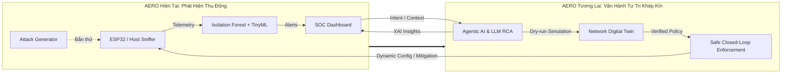
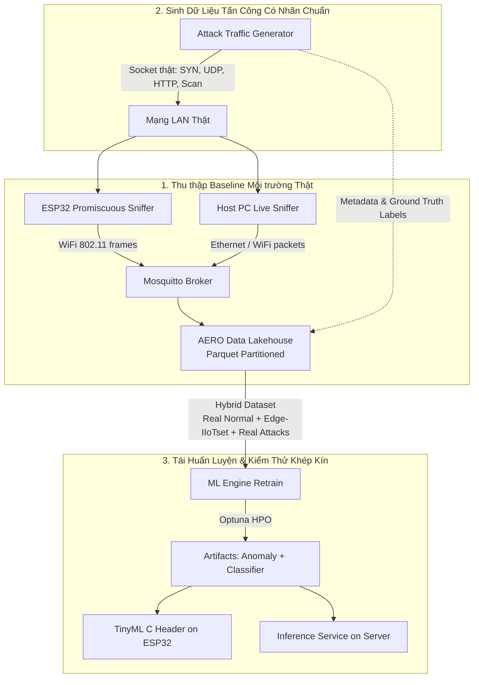
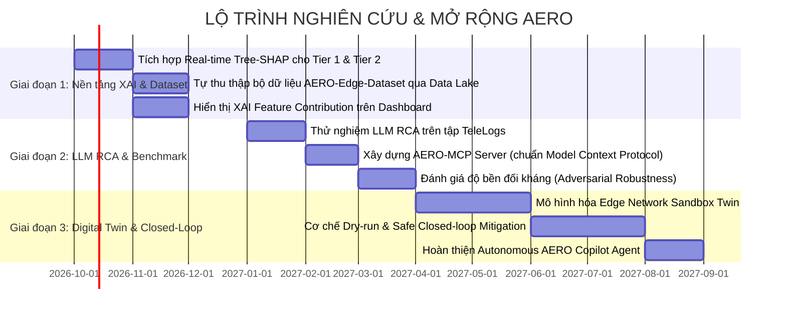

# BÁO CÁO PHÂN TÍCH: ĐỊNH HƯỚNG MỞ RỘNG HỆ THỐNG VÀ CHIẾN LƯỢC DỮ LIỆU HUẤN LUYỆN
> **Dựa trên tài liệu chuyên đề:** `AI_for_Networking_topics.pdf` (Cập nhật 08/2026)  
> **Hệ thống đối chiếu:** **AERO** (*Edge AI Anomaly Detection & Dual-Pipeline SOC*)  
> **Thời gian phân tích:** 10/2026  
> **Trạng thái triển khai:** *Tài liệu định hướng nghiên cứu & thiết kế kiến trúc (Chưa can thiệp mã nguồn)*

---

## MỤC LỤC
1. [Tổng Quan Bối Cảnh & Đánh Giá Điểm Giao Thoa](#1-tổng-quan-bối-cảnh--đánh-giá-điểm-giao-thoa)
2. [Chi Tiết 6 Hướng Mở Rộng Hệ Thống Theo Tài Liệu Nghiên Cứu](#2-chi-tiết-6-hướng-mở-rộng-hệ-thống-theo-tài-liệu-nghiên-cứu)
   - [2.1. Bản Sao Số Của Mạng (Network Digital Twin - NDT)](#21-bản-sao-số-của-mạng-network-digital-twin---ndt)
   - [2.2. Vận Hành Tự Trị (Self-Driving) & Chẩn Đoán Lỗi Bằng LLM](#22-vận-hành-tự-trị-self-driving--chẩn-đoán-lỗi-bằng-llm)
   - [2.3. Khả Năng Giải Thích (Explainable AI - XAI) Thời Gian Thực](#23-khả-năng-giải-thích-explainable-ai---xai-thời-gian-thực)
   - [2.4. Phân Quyền & Quản Lý Truy Cập Thông Minh (AI-enhanced IAM)](#24-phân-quyền--quản-lý-truy-cập-thông-minh-ai-enhanced-iam)
   - [2.5. Tấn Công & Phòng Thủ Đối Kháng (AI Offense & Defense)](#25-tấn-công--phòng-thủ-đối-kháng-ai-offense--defense)
   - [2.6. Tác Tử AI (Agentic AI) Cho Vận Hành Hạ Tầng Mạng Biên](#26-tác-tử-ai-agentic-ai-cho-vận-hành-hạ-tầng-mạng-biên)
3. [Tổng Hợp Các Dataset Có Sẵn & Phương Pháp Tự Thu Thập Dữ Liệu](#3-tổng-hợp-các-dataset-có-sẵn--phương-pháp-tự-thu-thập-dữ-liệu)
   - [3.1. Bảng Tổng Hợp Dataset Công Khai Chuẩn Quốc Tế](#31-bảng-tổng-hợp-dataset-công-khai-chuẩn-quốc-tế)
   - [3.2. Phương Pháp Tự Thu Thập & Sinh Dữ Liệu Thực Tế Trong AERO](#32-phương-pháp-tự-thu-thập--sinh-dữ-liệu-thực-tế-trong-aero)
4. [Lộ Trình Đề Xuất Nâng Cấp Hệ Thống (Phân Kỳ Triển Khai)](#4-lộ-trình-đề-xuất-nâng-cấp-hệ-thống-phân-kỳ-triển-khai)

---

## 1. TỔNG QUAN BỐI CẢNH & ĐÁNH GIÁ ĐIỂM GIAO THOA

### 1.1. Thực trạng kiến trúc hiện tại của hệ thống AERO
Hệ thống **AERO** hiện sở hữu nền tảng rất vững chắc về giám sát mạng biên và phân tích dữ liệu thời gian thực:
- **Tầng Telemetry biên (Edge Probes):** Vi điều khiển ESP32 bắt gói promiscuous mode (hỗ trợ channel hopping 1–13) kết hợp Host Sniffer (bắt trực tiếp card mạng máy tính).
- **Tầng Vận chuyển & Điều phối:** MQTT Mosquitto siêu nhẹ (`edge/telemetry/traffic`, `edge/attack/control`) kết nối trực tiếp với backend FastAPI.
- **Tầng Học máy kép (Dual AI Pipeline):**
  - *Tier 1 (Unsupervised):* Isolation Forest học trên baseline mạng sạch nhằm phát hiện bất thường Zero-day.
  - *Tier 2 (Supervised & TinyML):* Bộ phân loại (Decision Tree/Random Forest/XGBoost) huấn luyện trên 61 đặc trưng Edge-IIoTset phân biệt 15 lớp tấn công, có thể xuất mã C header (`tinyml_model.h`) chạy trực tiếp trên ESP32 ($< 50\,\mu s$).
- **Tầng Lưu trữ & Tái huấn luyện:** Data Lakehouse chuẩn Parquet (Snappy compression, phân vùng theo ngày) + SQLite catalog, hỗ trợ huấn luyện Hybrid (kết hợp dữ liệu chuẩn và baseline thực tế).
- **Tầng Kiểm thử & Giám sát:** Module bắn gói tin socket thật (`attack_traffic_generator.py`) và SOC Web Dashboard Cyberpunk Glassmorphism thời gian thực qua WebSocket.

### 1.2. Mối liên hệ với tài liệu nghiên cứu `AI_for_Networking_topics.pdf`
Tài liệu `AI_for_Networking_topics.pdf` (công bố/khảo sát giai đoạn 2024–2026) chỉ ra xu thế tất yếu của ngành mạng: **Chuyển dịch từ việc quan sát thụ động (Observational Telemetry) và cảnh báo đơn thuần sang Hệ thống Vận hành Khép kín Tự trị (Closed-Loop Autonomous / Self-Driving Networks)**, lấy **Network Digital Twin**, **Agentic AI** và **LLM Root Cause Analysis** làm động lực cốt lõi.

AERO hiện đã hoàn thành xuất sắc giai đoạn **"Quan sát & Phát hiện biên (Telemetry + Detection)"**. Những gợi mở từ tài liệu PDF chính là bản thiết kế hoàn hảo để nâng cấp AERO từ một hệ thống *Phát hiện xâm nhập (IDS)* thành một **Nền tảng Tự quản trị Mạng Biên Khép kín (Autonomous Edge Network Management & Defense Platform)**.

---

## 2. CHI TIẾT 6 HƯỚNG MỞ RỘNG HỆ THỐNG THEO TÀI LIỆU NGHIÊN CỨU

### 2.1. Bản Sao Số Của Mạng (Network Digital Twin - NDT)
*Căn cứ tài liệu: Mục 1 trang 1–3 (`TraffNet`, `Al-Shareeda et al.`, `Zheng et al. 5GC`, `Kathara`)*.

#### Phân tích cơ hội mở rộng cho AERO:
- **Xây dựng "Edge Network Sandbox Twin":** Hiện tại AERO đã có `esp32_simulator.py` và `attack_traffic_generator.py`. Ta có thể nâng cấp thành một mô hình Digital Twin nhẹ mô phỏng topology mạng biên (các Access Point, danh sách thiết bị IoT kết nối, băng thông từng kênh, độ trễ và hàng đợi gói tin).
- **Mô phỏng "Dry-run" trước khi ban hành chính sách phòng thủ:** Khi phát hiện tấn công (ví dụ một IP bị nghi ngờ là DDoS), thay vì chặn mù trên mạng thật, lệnh chặn được đưa vào Digital Twin để mô phỏng trước trong 5 giây. Nếu hành động chặn không làm sập lưu lượng hợp pháp (không gây lỗi dịch vụ kinh doanh), quyết định mới được áp dụng vào tường lửa mạng thật (giải quyết bài toán *"Closed-loop control thực sự"* nêu tại mục 1.3 của tài liệu).
- **Dự đoán lưu lượng (Traffic Forecasting):** Tích hợp thêm mô hình chuỗi thời gian (như GNN hoặc LSTNet/Informer) trên dữ liệu telemetry của Data Lakehouse để dự đoán đỉnh lưu lượng hoặc nghẽn kênh trước khi sự cố xảy ra.

---

### 2.2. Vận Hành Tự Trị (Self-Driving) & Chẩn Đoán Lỗi Bằng LLM
*Căn cứ tài liệu: Mục 2 trang 4–7 (`BiAn SIGCOMM 2025`, `Confucius SIGCOMM 2025`, `SADE 2026`, `R2Act 2026`, `TeleLogs 2025`)*.

#### Phân tích cơ hội mở rộng cho AERO:
- **Tầng Chẩn đoán Căn nguyên (Tier 3: LLM Root Cause Analysis Engine):**
  - Hiện tại, Tier 1 báo "Bất thường", Tier 2 báo "DDoS-UDP" hoặc "Port_Scanning". Nhưng người vận hành vẫn phải tự tìm hiểu tại sao thiết bị đó tấn công, port nào bị nhắm tới, có phải do cấu hình sai hay phần mềm độc hại.
  - Bổ sung module **LLM RCA**: Khi có Alert từ Tier 2, trích xuất 50 dòng log telemetry và PCAP header liên quan từ Data Lakehouse, nạp qua LLM (vận hành cục bộ qua Ollama hoặc API) để sinh báo cáo:
    1. Thiết bị nào là nguồn gốc và thiết bị nào là nạn nhân?
    2. Chuỗi sự kiện dẫn đến vi phạm (Time-line of incident).
    3. Mức độ nghiêm trọng và đề xuất khắc phục cụ thể.
- **Thu hẹp khoảng cách "Diagnosis-to-Action" (Bài toán R2Act 2026):**
  - Nghiên cứu R2Act chỉ ra LLM chẩn đoán rất tốt nhưng sinh lệnh khắc phục (recovery action) thường xuyên bị lỗi cú pháp hoặc gây sập mạng.
  - Xây dựng **Deterministic Action Executor**: LLM không trực tiếp gõ lệnh shell tùy tiện, mà chỉ chọn trong tập lệnh an toàn đã được định nghĩa trước (Parametric Playbooks): `quarantine_mac(mac_addr)`, `rate_limit_ip(ip, bps)`, `switch_wifi_channel(ch)`.

---

### 2.3. Khả Năng Giải Thích (Explainable AI - XAI) Thời Gian Thực
*Căn cứ tài liệu: Mục 3 trang 7–9 (`XAI-on-RAN 2025`, `Wang et al. 2024`, `3GPP TR 28.907`)*.

#### Phân tích cơ hội mở rộng cho AERO:
- **Thực trạng AERO:** Isolation Forest là thuật toán rừng cây ngẫu nhiên dạng unsupervised (hộp đen), rất khó để người quản trị biết đặc trưng nào trong 61 features đã kích hoạt điểm bất thường (anomaly score).
- **Giải pháp XAI thời gian thực (Lightweight Tree-SHAP / Fast Feature Attribution):**
  - Tích hợp bộ giải thích nhanh cho Tier 1 và Tier 2. Mỗi khi có gói tin/luồng bị gán nhãn bất thường, tính toán Top-3 thuộc tính đóng góp lớn nhất (ví dụ: `tcp.flags.syn` tăng đột biến, `packet_length_variance` tiệm cận 0, `flow_iat_mean` cực nhỏ).
- **Diễn giải tự nhiên đa đối tượng (Multi-stakeholder XAI):**
  - Dùng LLM chuyển các chỉ số SHAP phức tạp thành câu văn dễ hiểu trên SOC Dashboard:
    - *Góc nhìn Kỹ sư SOC:* "Phát hiện SYN Flood từ IP 192.168.1.55 với cờ SYN=1 chiếm 98% tổng gói, khoảng cách giữa các gói (IAT) < 2ms, kích thước payload cố định 64 bytes."
    - *Góc nhìn Quản trị viên:* "Thiết bị ESP32 Camera tại phòng khách có dấu hiệu bị mã độc lợi dụng phát động từ chối dịch vụ. Rủi ro: Làm nghẽn băng thông AP chính."

---

### 2.4. Phân Quyền & Quản Lý Truy Cập Thông Minh (AI-enhanced IAM)
*Căn cứ tài liệu: Mục 4 trang 9–11 (`VyMCP 2026`, `NLP-driven SDN 2025`, `NIST AI Agent Standards 2026`, `AGILE-6G 2025`)*.

#### Phân tích cơ hội mở rộng cho AERO:
- **Chuẩn giao tiếp MCP (Model Context Protocol) cho Hệ thống Mạng AERO:**
  - Lấy cảm hứng từ dự án `VyMCP` (Mục 4.2 trong tài liệu PDF - chuẩn MCP cho router VyOS), ta có thể xây dựng một **AERO-MCP Server**.
  - Cho phép các Agent AI bên ngoài (như Claude Desktop, Gemini, Antigravity Agent) có thể gọi các tool chuẩn hóa: `get_network_health()`, `query_data_lake()`, `inspect_node(mac)`, `apply_firewall_rule()`.
- **Phân quyền động theo ngữ cảnh (Context-Aware Dynamic Authorization):**
  - Nếu hệ thống đang ở trạng thái bình thường (Normal), Agent chỉ có quyền "Đọc" (Read-only / Observational).
  - Khi hệ thống chuyển sang trạng thái "Bị tấn công nghiêm trọng" (Alert High), quyền hạn của Agent được tạm thời nâng cấp (Elevated Privilege) để cô lập thiết bị, nhưng phải có chữ ký số xác thực hoặc xác nhận từ người vận hành (Human-in-the-loop).
- **Audit Logging bất biến:** Mọi thao tác do AI đề xuất và thực thi đều được ghi log vào SQLite Catalog và Parquet của Data Lakehouse để phục vụ thanh tra.

---

### 2.5. Tấn Công & Phòng Thủ Đối Kháng (AI Offense & Defense)
*Căn cứ tài liệu: Mục 5 trang 11–12 (`Cochise 2025`, `AutoPentester 2025`, `GAN Evasion Attacks 2024`, `CIC-IDS`, `UNSW-NB15`)*.

#### Phân tích cơ hội mở rộng cho AERO:
- **Kiểm thử độ bền đối kháng (Adversarial Robustness Testing):**
  - Nghiên cứu của Yan et al. (2024) chỉ ra rằng chỉ cần làm nhiễu nhẹ đặc trưng (ví dụ thêm dummy padding vào payload, chia nhỏ gói tin hoặc chèn jitter ngẫu nhiên), các mô hình ML-based IDS sẽ bị đánh lừa hoàn toàn.
  - Ta có thể mở rộng `attack_traffic_generator.py` để bổ sung chế độ **"Adversarial Mode"**: Tự động chèn nhiễu vào luồng DDoS hoặc Probe để kiểm tra giới hạn chịu đựng của Isolation Forest và Decision Tree hiện tại.
- **Tái huấn luyện đối kháng (Adversarial Retraining via Data Lakehouse):**
  - Thu nạp các luồng tấn công đối kháng này vào Data Lakehouse, sau đó chạy lại `--data-source hybrid` để mô hình học cách miễn dịch với các kỹ thuật che giấu lưu lượng tinh vi.
- **Hệ thống mồi nhử Deception nhẹ (Micro-Honeypot):**
  - Cấu hình một cổng dịch vụ ảo (hoặc một ESP32 giả mạo thiết bị IoT dễ bị xâm nhập) để dẫn dụ mã độc quét vào, ghi nhận toàn bộ payload mới làm mẫu dữ liệu Zero-day.

---

### 2.6. Tác Tử AI (Agentic AI) Cho Vận Hành Hạ Tầng Mạng Biên
*Căn cứ tài liệu: Mục 6 trang 12–15 (`NetClaw CCIE-level Agent`, `Confucius Meta`, `Nokia & Google Cloud 2026`)*.

#### Phân tích cơ hội mở rộng cho AERO:
- **Trợ lý vận hành mạng tự trị (AERO Copilot Agent):**
  - Xây dựng một Agent vận hành thông minh tích hợp ngay trên Web Dashboard.
  - Người dùng có thể ra lệnh bằng ngôn ngữ tự nhiên cấp cao (Intent-Based):
    - *"Hãy kiểm tra xem 1 giờ qua có node nào quét cổng không?"*
    - *"Thiết lập chế độ tiết kiệm năng lượng cho các node ESP32 và nhảy kênh quét Wi-Fi sang kênh 6 và 11."*
    - *"Phân tích nguyên nhân vì sao tỷ lệ gói tin lỗi trên kênh 1 đột ngột tăng 40%."*
- **Kiến trúc Multi-Agent phối hợp:**
  - *Telemetry Agent:* Chuyên theo dõi chất lượng kết nối, tỷ lệ lỗi, độ trễ và dung lượng Data Lakehouse.
  - *Security Agent:* Chuyên giám sát output của Dual AI Pipeline, tính toán độ tin cậy cảnh báo và truy tìm IP độc hại.
  - *Remediation Agent:* Chuyên lên kế hoạch khắc phục sự cố và đồng bộ với Digital Twin để kiểm thử trước khi thực thi.

---

## 3. TỔNG HỢP CÁC DATASET CÓ SẴN & PHƯƠNG PHÁP TỰ THU THẬP DỮ LIỆU

Khi triển khai các tác vụ huấn luyện (Training), tinh chỉnh (Fine-tuning) hoặc đánh giá benchmark (Evaluation) cho các hướng mở rộng trên, bảng dưới đây phân loại chi tiết các nguồn dữ liệu sẵn có và quy trình tự sinh dữ liệu:

### 3.1. Bảng Tổng Hợp Dataset Công Khai Chuẩn Quốc Tế

| Tác vụ AI / Training Task | Tên Dataset & Năm | Đặc điểm & Số lượng mẫu | Phù hợp cho Module nào | Nguồn truy cập / Nơi lưu trữ |
| :--- | :--- | :--- | :--- | :--- |
| **1. Phân loại tấn công IoT & Mạng biên** | **Edge-IIoTset** *(2022)* | 61 đặc trưng lưu lượng, 15 nhãn tấn công + Normal (Hơn 11 triệu bản ghi) | Tier 1 (Isolation Forest) & Tier 2 (Attack Classifier) | [IEEE Dataport / Kaggle](https://www.kaggle.com/datasets/mohamedamineferrag/edgeiiotset-cyber-security-dataset-of-iot-iiot) |
| **2. Phát hiện xâm nhập mạng diện rộng** | **CIC-IDS2017 / CSE-CIC-IDS2018** | Đầy đủ file PCAP và CSV trích xuất Flow (DDoS, DoS, Botnet, Web Attack, Infiltration) | Mở rộng tập đặc trưng mạng Host Sniffer | [UNB Canadian Institute for Cybersecurity](https://www.unb.ca/cic/datasets/ids-2017.html) |
| **3. Đánh giá độ bền đối kháng IDS** | **UNSW-NB15** | 49 đặc trưng, lưu lượng mạng thực tế mô phỏng 9 họ tấn công hiện đại | Benchmark đối kháng (Adversarial Robustness) | [UNSW Canberra](https://research.unsw.edu.au/projects/unsw-nb15-dataset) |
| **4. Telemetry cảm biến IoT & OS Log** | **TON_IoT Dataset** *(2021)* | Đồng bộ Telemetry mạng (PCAP), hệ điều hành Linux/Win và dữ liệu cảm biến IoT | Huấn luyện phát hiện bất thường đa tầng (Node + Mạng) | [IEEE Dataport TON_IoT](https://research.unsw.edu.au/projects/toniot-datasets) |
| **5. Chẩn đoán nguyên nhân gốc rễ (RCA) bằng LLM** | **TeleLogs** *(2025)* | Tập dữ liệu log sự cố mạng 5G/Wireless kèm nhãn RCA và chuỗi lập luận (Reasoning) | Fine-tuning LLM RCA Engine / Đánh giá Agent | [HuggingFace netop/TeleLogs](https://huggingface.co/datasets/netop/TeleLogs) |
| **6. Đánh giá chu trình Hành động Sửa lỗi (Action Validity)** | **R2Act Benchmark** *(2026)* | Đánh giá từ chẩn đoán lỗi đến hành vi phục hồi (Recovery-Aware Evaluation) | Benchmark cho Remediation Agent | [arXiv:2607.04623](https://arxiv.org/abs/2607.04623) |
| **7. Chẩn đoán phân tầng theo triệu chứng** | **SADE Benchmark** *(2026)* | Kịch bản sự cố mạng phân tầng theo họ lỗi (fault-family) và kỹ năng chẩn đoán | Xây dựng Skill Library cho Network Agent | [arXiv:2605.04530](https://arxiv.org/abs/2605.04530) |
| **8. Tấn công tự động bằng LLM (Pentest Logs)** | **Cochise Benchmark** *(2025)* | Chuỗi hành động xâm nhập Active Directory tự động của LLM Agent | Đánh giá kịch bản AI Offense vs Defense | [arXiv:2502.04227](https://arxiv.org/abs/2502.04227) |
| **9. Sinh lưu lượng Digital Twin & Quan hệ nhân quả** | **TraffNet** *(2023)* | Dữ liệu quan hệ nhân quả (Causality) sinh lưu lượng trong mô hình mạng Digital Twin | Huấn luyện mô hình Digital Twin / Traffic Prediction | [arXiv:2303.15954](https://arxiv.org/abs/2303.15954) |
| **10. Dữ liệu lưu lượng Internet thực tế quy mô lớn** | **MAWI Traffic Archive** | Cập nhật hàng ngày liên tục file PCAP thực từ mạng backbone WIDE Nhật Bản | Huấn luyện mô hình Traffic Baseline dài hạn | [MAWI Working Group](http://mawi.wide.ad.jp/mawi/) |

---

### 3.2. Phương Pháp Tự Thu Thập & Sinh Dữ Liệu Thực Tế Trong AERO

Bên cạnh việc dùng dữ liệu thứ cấp (dataset có sẵn), thế mạnh lớn nhất của dự án AERO là **khả năng tự thu thập và tự sinh dữ liệu độc lập (Autonomous Ground-Truth Data Collection)**:

#### Quy trình tự tạo dataset chi tiết:
1. **Thu thập Baseline bình thường thực tế (Real-World Benign Baseline):**
   - Chạy hệ thống ở chế độ `--data-source hybrid`.
   - ESP32 đặt ở chế độ `SNIFFER_MODE_ALL_NETWORKS` nhảy 13 kênh Wi-Fi trong 24–48 giờ ở môi trường văn phòng hoặc phòng lab.
   - Toàn bộ đặc trưng được trích xuất (gồm tỷ lệ cờ, kích thước khung, tốc độ gói, entropy MAC) được lưu vào `data_lake/raw/date=YYYY-MM-DD/`.
   - **Mục tiêu:** Dùng làm tập dữ liệu sạch để Isolation Forest học "chuẩn mực thế nào là bình thường" của chính môi trường đó, xóa bỏ hoàn toàn báo động giả (False Positives).

2. **Thu thập tập tấn công có gán nhãn thực tế (Real Attack Ground-Truth):**
   - Khởi chạy `attack_traffic_generator.py` với các kịch bản có gán nhãn và mốc thời gian (timestamp) chính xác:
     - `DDoS-SYN`: Bắn 10.000 gói SYN socket thật với các cổng đích khác nhau.
     - `UDP-Flood`: Bắn luồng UDP tốc độ cao giả lập video streaming tràn buffer.
     - `Port-Scan`: Quét tuần tự và ngẫu nhiên cổng dịch vụ.
     - `Adversarial-Jitter`: Bắn gói tin tấn công nhưng chèn độ trễ ngẫu nhiên 50–200ms và dummy bytes để tạo mẫu đối kháng.
   - Nhờ phát động bằng socket thật ra mạng LAN, cả card mạng máy tính và chip ESP32 đều "bắt sống" được các gói tin này trong thực tế.
   - Ghi lại đồng thời cả dữ liệu bắt được và nhãn phát động vào Data Lakehouse, tạo thành **Bộ dữ liệu chuẩn hóa của riêng dự án (AERO-Edge-Dataset)**.

3. **Thu thập chuỗi hành động và hội thoại cho Network Agent (Agent Trajectory & RCA Data):**
   - Ghi lại toàn bộ lịch sử: `[Telemetry Input] -> [AI Alert] -> [LLM Explanation] -> [Đề xuất hành động khắc phục] -> [Phản hồi của người vận hành (Chấp thuận / Từ chối)]`.
   - Bộ dữ liệu này được định dạng theo chuẩn JSONL (chuẩn dữ liệu hội thoại / prompt-response) để sau này dùng cho kỹ thuật **DPO (Direct Preference Optimization)** hoặc **Fine-tuning** mô hình ngôn ngữ chuyên sâu cho mạng.

---

## 4. LỘ TRÌNH ĐỀ XUẤT NÂNG CẤP HỆ THỐNG (PHÂN KỲ TRIỂN KHAI)

Để mở rộng hệ thống một cách khoa học, khả thi và không phá vỡ tính ổn định của mã nguồn hiện tại, đề xuất lộ trình 3 giai đoạn:

### Chi tiết các mốc mục tiêu:

- **Giai đoạn 1 (Ngắn hạn - Khả thi cao, tác động trực quan):**
  - Giữ nguyên kiến trúc lõi, bổ sung module **XAI giải thích lý do cảnh báo** (Feature Importance / SHAP) hiển thị trực tiếp lên SOC Web Dashboard.
  - Sử dụng hệ thống thu thập hiện tại để tạo ra bộ dữ liệu **AERO-Edge-Dataset** (chuẩn hóa file Parquet từ Data Lakehouse) làm minh chứng thực nghiệm cho đề tài.
- **Giai đoạn 2 (Trung hạn - Tích hợp AI Agentic & LLM):**
  - Triển khai **LLM Root Cause Analysis (RCA)**: Dùng mô hình mã nguồn mở cục bộ (như Llama 3 / Mistral hoặc DeepSeek qua Ollama) hoặc Gemini API để phân tích log và PCAP, đánh giá trên benchmark `TeleLogs` và `R2Act`.
  - Chuẩn hóa cổng giao tiếp của AERO theo chuẩn **MCP (Model Context Protocol)** tương tự dự án VyMCP, cho phép các Agent tự động tương tác với hệ thống an toàn.
  - Thử nghiệm tấn công đối kháng lên Isolation Forest và tái huấn luyện đối kháng.
- **Giai đoạn 3 (Dài hạn - Tự trị khép kín & Digital Twin):**
  - Xây dựng **Edge Network Digital Twin**: Mô phỏng trạng thái mạng để thử nghiệm các chính sách điều khiển (Dry-run).
  - Hoàn thiện vòng lặp tự trị **Closed-Loop Zero-Touch**: Từ phát hiện bất thường -> chẩn đoán căn nguyên -> thử nghiệm trong twin -> thực thi cách ly mạng an toàn mà không cần con người can thiệp thủ công.

---
*Tài liệu này được biên soạn độc lập nhằm phục vụ định hướng nghiên cứu khoa học và phát triển sản phẩm tương lai.*
