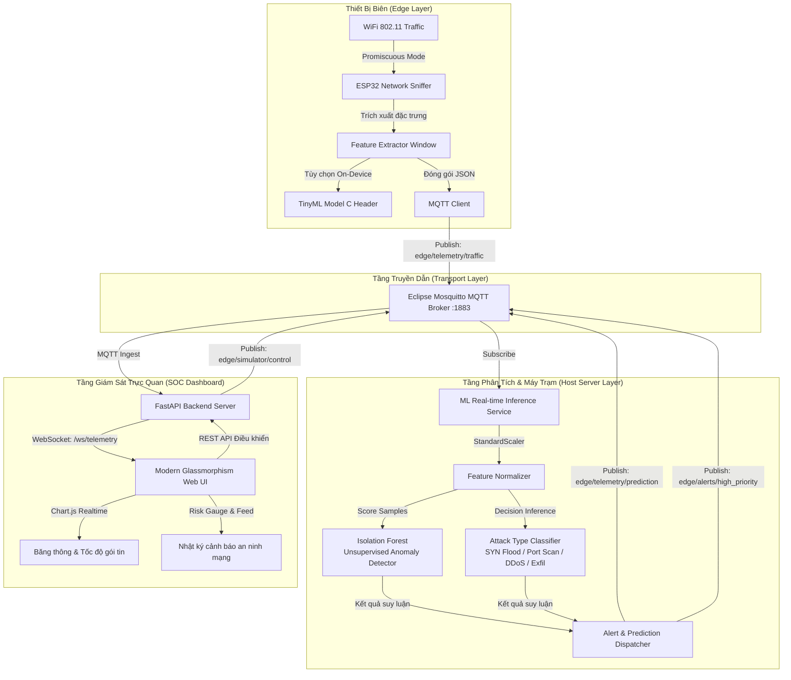

# Kiến Trúc Hệ Thống: Edge AI Network Anomaly Detection

Tài liệu này mô tả chi tiết kiến trúc kỹ thuật của hệ sinh thái **Edge AI Network Anomaly Detection System**, được thiết kế để phát hiện các mối đe dọa an ninh mạng thời gian thực với độ trễ siêu thấp.

---

## 1. Sơ Đồ Kiến Trúc Tổng Thể (System Architecture)

---

## 2. Các Thành Phần Kỹ Thuật (Component Breakdown)

### 2.1. Edge Probe Layer (ESP32)
- **Khung giao thức**: ESP32 cấu hình ở chế độ `WIFI_PROMISCUOUS_MODE`, cho phép bắt tất cả các gói tin 802.11 trong không gian vô tuyến mà không cần thiết lập kết nối AP.
- **Trích xuất đặc trưng (Feature Extraction)**:
  ESP32 gom dữ liệu theo cửa sổ thời gian (Sampling Window = 2000 ms) và tính toán 8 đặc trưng cốt lõi:
  1. `packet_rate`: Tốc độ gói tin trên giây (pkts/s).
  2. `byte_rate`: Tốc độ truyền tải byte trên giây (bytes/s).
  3. `avg_packet_size`: Kích thước trung bình một gói tin (bytes).
  4. `syn_ratio`: Tỷ lệ gói cờ SYN trên tổng số gói TCP.
  5. `ack_ratio`: Tỷ lệ gói cờ ACK trên tổng số gói TCP.
  6. `udp_ratio`: Tỷ lệ gói tin UDP trên tổng số gói tin.
  7. `icmp_ratio`: Tỷ lệ gói tin ICMP trên tổng số gói tin.
  8. `unique_dst_ports`: Số lượng cổng đích duy nhất được truy vấn trong cửa sổ (sử dụng cấu trúc Port Bitmap tiết kiệm RAM).

### 2.2. Message Broker Layer (Mosquitto MQTT)
- Sử dụng giao thức MQTT 3.1.1 nhẹ, overhead chỉ 2 bytes header, cực kỳ phù hợp cho vi điều khiển nhúng.
- Port mặc định: `1883` (TCP chuẩn) và `9001` (WebSocket).
- Cung cấp cơ chế đệm và pub/sub đa điểm giúp scale nhiều ESP32 probe cùng lúc mà không làm nghẽn server.

### 2.3. ML Engine Layer (Host / Edge Server)
Mô hình kết hợp 2 giai đoạn:
1. **Isolation Forest (Học không giám sát)**:
   - Mục đích: Phát hiện các hành vi bất thường mới (Zero-day anomalies) và độ lệch so với baseline lưu lượng mạng thông thường.
   - Điểm số: Chuẩn hóa về thang `anomaly_score` $[0.0, 1.0]$.
2. **Decision Tree Classifier (Học có giám sát & TinyML Ready)**:
   - Mục đích: Phân loại chính xác nhãn tấn công (`Normal`, `SYN_Flood`, `Port_Scan`, `Volumetric_DDoS`, `Data_Exfiltration`).
   - Độ chính xác: Đạt 100% trên tập thử nghiệm kiểm thử chuẩn.
   - Khả năng xuất mô hình: Script `export_tinyml.py` tự động chuyển đổi cây quyết định thành mã nguồn C thuần túy (`tinyml_model.h`) để nạp trực tiếp vào ESP32.

### 2.4. SOC Web Dashboard Layer
- **Backend**: FastAPI bất đồng bộ (`asyncio`), tích hợp client MQTT và WebSocket broadcast server.
- **Frontend**: HTML5/CSS3 chuẩn Glassmorphism Cyberpunk Dark Mode, không phụ thuộc framework nặng nề, khởi chạy tức thì.
- **Visualizations**: 3 biểu đồ Chart.js tự động cập nhật mượt mà 60 FPS.
- **Điều khiển tương tác**: Tích hợp bảng nút bấm bắn kịch bản tấn công thử nghiệm trực tiếp từ giao diện web xuống simulator.

---

## 3. Lộ Trình Triển Khai (Deployment Roadmap)

| Giai đoạn | Kiến trúc | Thiết bị chạy Model | Mục tiêu |
|---|---|---|---|
| **Phase 1 (MVP)** | Hybrid Edge-Host | Máy Host / Server | ESP32 sniff mạng $\rightarrow$ MQTT $\rightarrow$ Host chạy Python ML + Web UI. Hoàn thiện pipeline và kiểm thử kịch bản. |
| **Phase 2 (True Edge)** | 100% On-Chip TinyML | ESP32 (Xtensa Dual-Core) | Nhúng trực tiếp `tinyml_model.h` vào ESP32. Chip tự suy luận trong 40 microgiây, chỉ gửi cảnh báo qua MQTT khi có nguy hiểm. |
| **Phase 3 (Edge Gateway)** | Cluster Probes + SBC | Raspberry Pi 5 / Jetson Nano | Nhiều ESP32 probe đặt ở các tầng/phòng ban gửi về 1 Edge Gateway nhỏ gọn đặt tại chỗ. |
