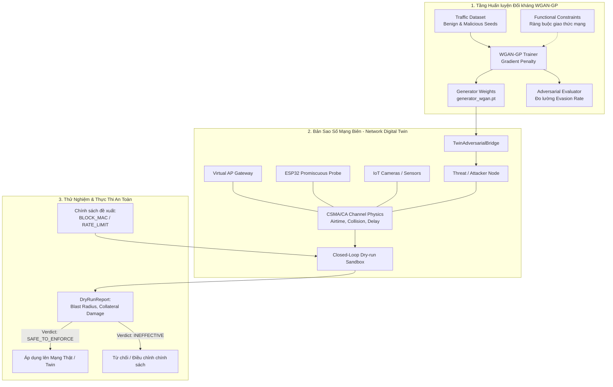

# HƯỚNG DẪN HỆ THỐNG NETWORK DIGITAL TWIN VÀ HUẤN LUYỆN MÔ HÌNH ĐỐI KHÁNG WGAN-GP

> **Dự án:** AERO - Autonomous Edge AI Network Anomaly Detection  
> **Cập nhật:** 10/2026  
> **Các module mới triển khai:** `digital_twin/` và `ml_engine/adversarial/`

---

## 1. TỔNG QUAN KIẾN TRÚC MỚI

Hệ thống đã được tích hợp thành công 2 trụ cột nghiên cứu tiên tiến từ tài liệu `AI_for_Networking_topics.pdf`:



---

## 2. MODULE 1: WGAN-GP SINH TẤN CÔNG ĐỐI KHÁNG (`ml_engine/adversarial/`)

### 2.1. Cơ chế hoạt động của WGAN-GP
- **Mục tiêu:** Sinh ra vector nhiễu đối kháng $\Delta$ cộng vào vector tấn công gốc $x_{mal}$ sao cho mẫu mới $x_{adv} = x_{mal} + \Delta$ có thể lẩn tránh các bộ phát hiện Unsupervised (Isolation Forest) và Supervised (Classifier).
- **Ràng buộc bảo toàn chức năng (Functional Feature Constraints):**
  - Không được làm mất đi tính khả thi của cuộc tấn công (ví dụ: tấn công SYN Flood thì `syn_ratio` vẫn phải duy trì cao $\ge 0.40$; UDP Flood thì `udp_ratio` $\ge 0.50$; Port Scan thì số lượng port quét $\ge 5$).
  - Các đặc trưng về tốc độ (`packet_rate`), kích thước (`avg_packet_size`), và độ trễ được tinh chỉnh khéo léo để mô phỏng kỹ thuật **Low & Slow** và **Dummy Padding**.
- **Wasserstein Loss & Gradient Penalty:**
  $$\mathcal{L}_D = \mathbb{E}[D(x_{adv})] - \mathbb{E}[D(x_{real})] + \lambda_{gp} \mathbb{E}[(||\nabla_{\hat{x}} D(\hat{x})||_2 - 1)^2]$$

### 2.2. Lệnh huấn luyện WGAN-GP
Chạy script huấn luyện độc lập:
```bash
# Huấn luyện trên tập đặc trưng Sliding Window (8 features)
python ml_engine/adversarial/train_gan.py --epochs 25 --batch-size 64

# Hoặc tùy chỉnh learning rate và thư mục xuất:
python ml_engine/adversarial/train_gan.py --epochs 30 --lr 0.0002 --output-dir ml_engine/models/adversarial_wgan
```

**Các artifacts sinh ra tại `ml_engine/models/adversarial_wgan/`:**
- `generator_wgan.pt`: Trọng số mạng Generator.
- `critic_wgan.pt`: Trọng số mạng Critic/Discriminator.
- `adversarial_config.json`: Cấu hình đặc trưng, min-max bounds, latent dimension.
- `adversarial_test_samples.csv`: 1.000 mẫu đối kháng đã sinh ra kèm nhãn.
- `evasion_evaluation_results.json`: Báo cáo tỷ lệ lẩn tránh (Evasion Rate) và độ lệch đặc trưng.

---

## 3. MODULE 2: BẢN SAO SỐ MẠNG BIÊN (`digital_twin/`)

### 3.1. Các thành phần mô phỏng vật lý mạng
1. **Topology mạng ảo:**
   - **Gateway (Core AP):** Kênh Wi-Fi trung tâm (mặc định Ch 6), giám sát dung lượng kênh 25 Mbps.
   - **ESP32 Edge Probe:** Mô phỏng vi điều khiển Promiscuous, bộ đệm khung (buffer occupancy), độ trễ xử lý.
   - **Benign IoT Nodes:** IoT Security Camera (luồng RTSP 80 pkts/s), IoT Environmental Sensor (bắn MQTT 5 pkts/s).
   - **Threat Node:** Nút phát động tấn công thường hoặc đối kháng GAN.
2. **Vật lý không gian vô tuyến (CSMA/CA Channel Contention):**
   - Tính toán tỷ lệ chiếm dụng kênh (`Airtime Utilization`).
   - Khi Airtime vượt quá 60%, xác suất va chạm gói tin (`Collision Probability`) tăng theo hàm phi tuyến $P_{col} \propto (\text{Airtime} - 0.60)^{1.8}$.
   - Hàng đợi M/M/1 làm tăng độ trễ mạng từ $2.7\,\text{ms}$ lên đến hàng trăm mili-giây và gây rớt gói tin trên camera IoT.
3. **Thử nghiệm khép kín trong Sandbox (Closed-Loop Dry-run):**
   - Đánh giá chính sách phòng thủ (ví dụ: `BLOCK_MAC`, `RATE_LIMIT_IP`, `SWITCH_CHANNEL`).
   - Tính toán **Blast Radius** và **Collateral Damage** (mức độ ảnh hưởng đến thiết bị bình thường).
   - Đưa ra phán quyết tự động: `SAFE_TO_ENFORCE`, `RISK_OF_COLLATERAL_DAMAGE`, hoặc `INEFFECTIVE`.

### 3.2. Lệnh chạy mô phỏng Digital Twin & GAN
Khởi chạy kịch bản thử nghiệm trực quan qua terminal:
```bash
python digital_twin/run_twin.py
```

Quy trình mô phỏng trải qua 5 giai đoạn:
1. **Giai đoạn 1:** Đo đạc Baseline bình thường (Airtime < 10%, Latency ~2.7ms).
2. **Giai đoạn 2:** Bị tấn công tiêu chuẩn (SYN Flood 3.500 pkts/s, Airtime tăng, nghẽn kênh).
3. **Giai đoạn 3:** Nạp tấn công đối kháng GAN (WGAN-GP tinh chỉnh rate và cờ ACK/UDP).
4. **Giai đoạn 4:** Dry-run đánh giá 2 chính sách: Chặn MAC (An toàn 99.4%) vs Nhảy kênh (Không hiệu quả do tấn công theo).
5. **Giai đoạn 5:** Áp dụng chính sách an toàn, dập tắt 100% tấn công, đưa mạng về trạng thái xanh.

---

## 4. TÍCH HỢP TẤN CÔNG ĐỐI KHÁNG QUA SOCKET MẠNG THẬT

Module `firmware/simulator/attack_traffic_generator.py` đã được mở rộng thêm hàm `burst_adversarial_evasion()`. 

Người dùng có thể phát động luồng đối kháng socket thật ra mạng LAN để kiểm tra trực tiếp phản ứng của chip ESP32 và Host Sniffer:
- **Tự động qua lệnh MQTT:** Gửi payload `{"scenario": "Adversarial"}` tới topic `edge/attack/control`.
- **Đặc tính luồng đối kháng:**
  - Kỹ thuật **Low & Slow**: Tốc độ vừa phải, chèn jitter ngẫu nhiên 5–25ms.
  - Payload biến thiên ngẫu nhiên từ 40 đến 520 bytes (mô phỏng dummy padding của WGAN).
  - Trộn gói tin hợp pháp để hạ thấp `syn_ratio`.
