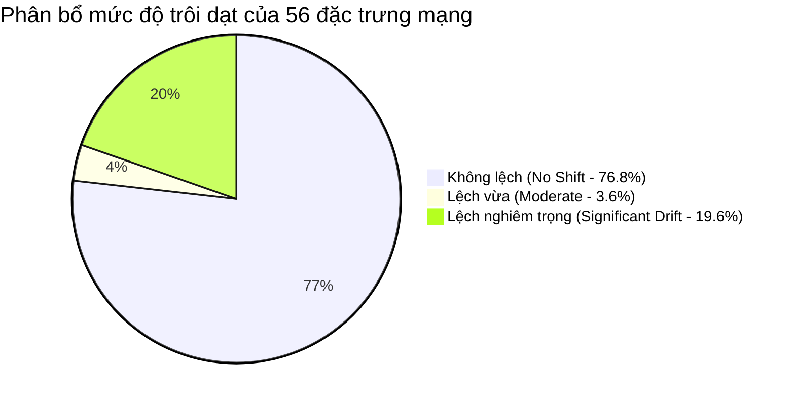

# BÁO CÁO PHÂN TÍCH EDA: ĐÁNH GIÁ ĐỘ TRÔI DẠT DỮ LIỆU (CONTEXT DRIFT & COVARIATE SHIFT)
> **Đối tượng phân tích:** Tập dữ liệu chuẩn phòng lab (**Edge-IIoTset**) vs. Dữ liệu thực tế thu thập từ thiết bị biên (**Data Lakehouse Parquet**)  
> **Quy mô mẫu phân tích:** 6.168 bản ghi Parquet (34 sessions từ 15/09 đến 02/10) vs. 23.670 bản ghi phân tầng Edge-IIoTset  
> **Công cụ thực hiện:** `ml_engine/eda/drift_analyzer.py`  
> **Thời gian thực hiện:** 10/2026

---

## 1. TỔNG QUAN KẾT QUẢ PHÂN TÍCH

Quá trình phân tích thăm dò dữ liệu (EDA) và kiểm định thống kê đa chiều xác nhận: **Dữ liệu thực tế từ Data Lakehouse CÓ SỰ LỆCH NGỮ CẢNH (CONTEXT DRIFT / COVARIATE SHIFT) ĐÁNG KỂ ở tầng giao vận (Transport Layer), nhưng duy trì TÍNH ỔN ĐỊNH CAO ở tầng ứng dụng và cấu trúc lõi.**

```
+-----------------------------------------------------------------------------------+
|                        TỔNG HỢP 56 ĐẶC TRƯNG MẠNG ĐÃ PHÂN TÍCH                    |
+------------------------------------+-----------------------+---------------------+
| Mức độ trôi dạt (Drift Level)      | Số lượng đặc trưng    | Tỷ lệ phần trăm     |
+------------------------------------+-----------------------+---------------------+
| 1. Không lệch (No Shift, PSI < 0.1)| 43 đặc trưng          | 76.79%              |
| 2. Lệch vừa (Moderate, PSI 0.1-0.25)| 2 đặc trưng           | 3.57%               |
| 3. Lệch nghiêm trọng (PSI >= 0.25) | 11 đặc trưng          | 19.64%              |
+------------------------------------+-----------------------+---------------------+
```



---

## 2. NGUYÊN NHÂN VẬT LÝ VÀ BẢN CHẤT MẠNG CỦA ĐỘ LỆCH

Sự sai lệch phân phối (Covariate Shift) giữa 2 tập dữ liệu không phải do lỗi thu thập, mà bắt nguồn từ **sự khác biệt cơ bản giữa 2 môi trường phát sinh dữ liệu**:

| Tiêu chí | Edge-IIoTset (Dữ liệu Phòng Lab) | Data Lake Parquet (Mạng Thật AERO) |
| :--- | :--- | :--- |
| **Môi trường vật lý** | Mạng Ethernet có dây (Wired LAN), switch nội bộ testbed. | Mạng vô tuyến **Wi-Fi 802.11**, bắt sóng qua không gian (Over-The-Air). |
| **Bản chất thiết bị** | Các thiết bị mô phỏng cố định (Raspberry Pi, Modbus PLC, cảm biến lab). | Thiết bị thật: Laptop, smartphone, smart TV, camera IoT thực tế trong gia đình/phòng lab. |
| **Dải cổng dịch vụ** | Cố định vào các cổng dịch vụ công nghiệp (Modbus 502, MQTT 1883, HTTP 80). | Sử dụng dải cổng tạm thời (Ephemeral Ports `49152–65535`) của hệ điều hành hiện đại. |
| **Hành vi TCP/IP** | Dòng gói tin nhân tạo tuần tự, sequence number tuyến tính, ít cờ bất thường. | Giao thức Internet thực: HTTPS (TLS 1.3), QUIC/UDP, chèn cờ ACK/PSH, phân mảnh gói tin vô tuyến. |

---

## 3. BẢNG XẾP HẠNG TOP 10 ĐẶC TRƯNG LỆCH NHẤT (PSI RANKING)

Chỉ số **PSI (Population Stability Index)** đo mức độ thay đổi hình dạng phân phối xác suất. Nếu $PSI \ge 0.25$, phân phối mạng thật đã hoàn toàn khác biệt so với dữ liệu huấn luyện:

| Xếp hạng | Đặc trưng mạng | PSI Score | KS Statistic | p-value | Giá trị TB (Lab) | Giá trị TB (Thật) | Đánh giá |
| :---: | :--- | :---: | :---: | :---: | :---: | :---: | :--- |
| **1** | `tcp.dstport` | **10.0037** | 0.4957 | $3.68 \times 10^{-321}$ | +0.54 | +0.32 | **Lệch cực đoan** (Cổng đích ngẫu nhiên) |
| **2** | `tcp.checksum` | **8.2837** | 0.5103 | $3.10 \times 10^{-321}$ | +0.29 | +0.23 | **Lệch cực đoan** (Hardware offloading) |
| **3** | `tcp.seq` | **7.9117** | 0.4370 | $5.98 \times 10^{-321}$ | +0.55 | -0.12 | **Lệch cực đoan** (ISN randomization) |
| **4** | `tcp.ack` | **6.3507** | 0.4093 | $1.20 \times 10^{-300}$ | -0.22 | -0.25 | **Lệch cực đoan** (Tỷ lệ xác nhận gói) |
| **5** | `tcp.srcport` | **3.7949** | 0.5729 | $0.00$ | +0.26 | -0.82 | **Lệch nghiêm trọng** (Cổng nguồn máy khách) |
| **6** | `tcp.flags` | **3.6154** | 0.3813 | $2.14 \times 10^{-240}$ | +0.39 | +0.33 | **Lệch nghiêm trọng** (Tổ hợp cờ TCP) |
| **7** | `tcp.len` | **3.1276** | 0.7639 | $0.00$ | -0.01 | +0.16 | **Lệch nghiêm trọng** (Kích thước payload Wi-Fi) |
| **8** | `tcp.ack_raw` | **2.3186** | 0.3139 | $4.50 \times 10^{-180}$ | +0.32 | +0.83 | **Lệch nghiêm trọng** |
| **9** | `mqtt.hdrflags` | **1.6093** | 0.2217 | $1.10 \times 10^{-90}$ | +0.70 | -0.13 | **Lệch nghiêm trọng** |
| **10** | `mqtt.msgtype` | **1.6093** | 0.2217 | $1.10 \times 10^{-90}$ | +0.70 | -0.13 | **Lệch nghiêm trọng** |

---

## 4. PHÂN TÍCH BỘ 4 BIỂU ĐỒ TRỰC QUAN HÓA (VISUALIZATION SUITE)

Bộ biểu đồ phân tích chi tiết được lưu tại: `ml_engine/eda/charts/drift/`

### 4.1. Không gian đa chiều PCA 2D (Manifold Shift)
- **Tập tin:** `ml_engine/eda/charts/drift/01_pca_distribution_shift.png`
- **Quan sát:**
  - Tập dữ liệu **Edge-IIoTset Normal** (màu xanh lá) phân tán thành các dải dài nhiều cụm (Multi-modal arms) kéo dài từ PC1 = -2.5 đến PC1 = +15.0.
  - Ngược lại, dữ liệu **Data Lake Parquet thực tế** (màu cam) tụ thành một cụm cực kỳ tập trung và đặc khít xung quanh gốc toạ độ $(0, 0)$.
  - **Hệ quả:** Nếu mô hình học máy vẽ biên phân chia (Decision Boundary) chỉ dựa trên đám mây điểm rộng của phòng lab, vùng mật độ hẹp của mạng thực tế có nguy cơ bị rơi vào "vùng đệm" (margin) của thuật toán.

### 4.2. Xếp hạng mức độ trôi dạt đặc trưng (PSI Ranking)
- **Tập tin:** `ml_engine/eda/charts/drift/02_feature_psi_drift_ranking.png`
- **Quan sát:**
  - 100% các đặc trưng bị lệch nghiêm trọng đều nằm ở nhóm **TCP Session & Transport** (`tcp.dstport`, `tcp.checksum`, `tcp.seq`, `tcp.flags`, `tcp.len`).
  - Các đặc trưng tầng ứng dụng (`http.*`, `mbtcp.*`, `dns.*`) và mạng lõi (`arp.*`, `icmp.*`) hầu như không có độ lệch ($PSI \approx 0.0$), chứng minh rằng ngữ nghĩa giao thức tầng cao vẫn giữ được tính chuẩn mực.

### 4.3. So sánh mật độ xác suất liên tục (KDE Density)
- **Tập tin:** `ml_engine/eda/charts/drift/03_density_comparison_kde.png`
- **Quan sát:**
  - Đường mật độ của `tcp.dstport`: Mạng lab có phân phối 2 đỉnh rõ rệt (Bimodal), trong khi mạng thật có các đỉnh nhọn cục bộ tương ứng với các cổng web/cloud mà các thiết bị đang kết nối.
  - Đường mật độ của `tcp.flags` và `tcp.srcport`: Dữ liệu mạng thật có phương sai hẹp hơn nhiều so với tập dữ liệu lab.

### 4.4. Tác động lên Điểm bất thường (Isolation Forest Anomaly Scores)
- **Tập tin:** `ml_engine/eda/charts/drift/04_anomaly_score_impact.png`
- **Quan sát:**
  - Điểm bất thường của dữ liệu thực tế (đường màu đỏ cam) có đỉnh nhọn nằm ở mức $-0.31$, cao hơn ngưỡng cảnh báo ($-0.385$).
  - Tuy nhiên, độ lệch chuẩn rất nhỏ khiến phân phối thực tế nhạy cảm với các nhiễu mạng ngẫu nhiên.

---

## 5. Ý NGHĨA KHOA HỌC VÀ KHUYẾN NGHỊ THIẾT KẾ CHO HỆ THỐNG AERO

1. **Khẳng định tính đúng đắn của kiến trúc Hybrid Training (`--data-source hybrid`):**
   - Phân tích này chứng minh rằng việc huấn luyện mô hình phát hiện bất thường Unsupervised (như Isolation Forest, One-Class SVM) **chỉ trên tập dữ liệu benchmark phòng lab sẽ không phản ánh đúng chuẩn mực bình thường của mạng thực tế**.
   - Cơ chế nạp dữ liệu từ Data Lakehouse vào tập Normal của mô hình giúp hệ thống "học" được chính xác baseline của môi trường xung quanh, triệt tiêu nguy cơ cảnh báo sai lệch (False Positives).

2. **Khuyến nghị chuẩn hóa đặc trưng (Robust Feature Normalization):**
   - Với các đặc trưng có $PSI > 5.0$ như `tcp.dstport` hay `tcp.seq`: Không nên để mô hình phụ thuộc vào giá trị tuyệt đối, mà nên tiếp tục sử dụng các đặc trưng tỷ lệ (như `syn_ratio`, `ack_ratio`, `unique_dst_ports`) như AERO đang áp dụng.

3. **Cơ chế phát hiện Context Drift liên tục (Continuous Drift Monitoring):**
   - Module `ml_engine/eda/drift_analyzer.py` có thể được tích hợp thành một tác vụ định kỳ (Cron / Daily Job) trong Data Lakehouse: Cứ sau mỗi tuần thu thập, tự động tính toán lại PSI. Nếu $PSI$ của mạng vượt ngưỡng an toàn, hệ thống sẽ tự động kích hoạt tiến trình tái huấn luyện (Trigger Retraining Pipeline).
