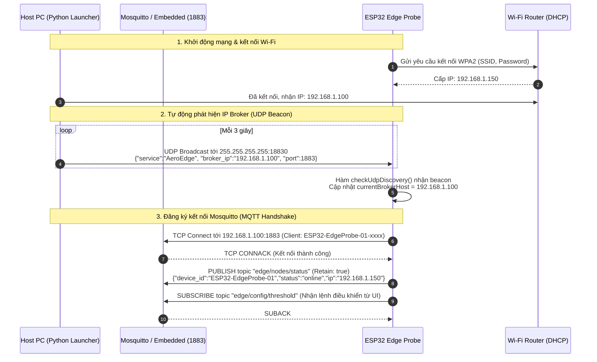

# KIẾN TRÚC MẠNG & PIPELINE HOẠT ĐỘNG TOÀN DIỆN CỦA ESP32 VÀ MOSQUITTO

Tài liệu này mô tả chi tiết toàn bộ chu trình hoạt động của thiết bị biên ESP32: từ cơ chế phát hiện mật khẩu Wi-Fi ngầm (Zero-Config), kỹ thuật dò sóng Promiscuous Mode, định vị và kết nối MQTT Mosquitto, định tuyến địa chỉ IP giữa các máy trong mạng, đến cơ chế phân phối bản tin về Data Lake và Web Dashboard.

---

## 1. TỔNG QUAN LUỒNG DỮ LIỆU & BẢN ĐỒ ĐỊA CHỈ IP (IP MAP)

### 1.1. Bản đồ định danh thiết bị và sở hữu IP trong hệ thống

Khi hệ thống vận hành trong một mạng Wi-Fi thực tế (ví dụ dải mạng gia đình/văn phòng `192.168.1.0/24`), các địa chỉ IP được phân bổ và sở hữu như sau:

| Thiết bị / Thành phần | Chủ sở hữu vật lý | Địa chỉ IP ví dụ | Cổng (Port) | Vai trò trong hệ thống |
| :--- | :--- | :--- | :--- | :--- |
| **Wi-Fi Router / AP** | Bộ định tuyến nhà mạng / Router | `192.168.1.1` (Gateway) | - | Cấp phát DHCP, định tuyến mạng, phát sóng Beacon 802.11 |
| **ESP32 Edge Probe** | Vi điều khiển ESP32 vật lý | `192.168.1.150` (hoặc do DHCP cấp) | Port TCP ngẫu nhiên | Bắt sóng vô tuyến Promiscuous, chạy TinyML, gửi MQTT Telemetry |
| **Host PC (Máy tính chạy code)** | Laptop / PC Windows/Linux | `192.168.1.100` (IP card Wi-Fi LAN) | `1883`, `18830`, `8000` | Máy chủ trung tâm (Chạy Mosquitto, Data Lake, ML Engine, Dashboard) |
| **Mosquitto / Embedded Broker** | Chạy trên Host PC | `192.168.1.100` (Lắng nghe `0.0.0.0`) | `1883` | Trạm trung chuyển message MQTT nhận từ ESP32 |
| **UDP Beacon Worker** | Luồng ngầm trên Host PC | `192.168.1.100` | `18830` (Broadcast `255.255.255.255`) | Phát thông báo định kỳ thông báo IP Host PC cho ESP32 |
| **ML Inference & Data Lake** | Tiến trình Python trên Host PC | `127.0.0.1` (Loopback nội bộ Host PC) | Kết nối client tới `1883` | Tiêu thụ bản tin để chấm điểm dị biệt và ghi tệp Parquet |
| **FastAPI Backend & UI** | Tiến trình Python trên Host PC | `192.168.1.100` / `127.0.0.1` | `8000` (HTTP & WebSocket) | Cung cấp giao diện Web SOC Dashboard cho người dùng |

---

### 1.2. Trả lời trực tiếp: "Mosquitto truyền bản tin từ IP nào đến IP nào? IP đấy của máy nào?"

```
                                  [KHÔNG GIAN VÔ TUYẾN (AIRWAVES)]
                       Khung sóng 802.11 của TẤT CẢ thiết bị (Điện thoại, PC, Router, Camera)
                                                 │
                                                 ▼ (Promiscuous Sniffer)
                                      ┌─────────────────────┐
                                      │   ESP32 Edge Probe  │
                                      │  IP: 192.168.1.150  │
                                      └──────────┬──────────┘
                                                 │
                                                 │ Gói tin TCP: MQTT PUBLISH
                                                 │ Nguồn (Source IP)     : 192.168.1.150 (ESP32)
                                                 │ Đích  (Destination IP): 192.168.1.100 (Host PC)
                                                 │ Cổng đích (Dst Port)  : 1883
                                                 ▼
                                      ┌─────────────────────┐
                                      │ Host PC: Mosquitto  │
                                      │  IP: 192.168.1.100  │
                                      │      Port: 1883     │
                                      └──────────┬──────────┘
                                                 │
                                                 │ Mosquitto phân phối nội bộ (Local Loopback)
                                                 │ Source IP: 127.0.0.1 (Mosquitto)
                                                 │ Dst IP   : 127.0.0.1 (Các tiến trình Backend)
                         ┌───────────────────────┼────────────────────────┐
                         ▼                       ▼                        ▼
               ┌───────────────────┐   ┌───────────────────┐    ┌───────────────────┐
               │    Data Lake      │   │    ML Engine      │    │  FastAPI Backend  │
               │ (data_lake/raw/)  │   │(inference_service)│    │     (Port 8000)   │
               └───────────────────┘   └───────────────────┘    └─────────┬─────────┘
                                                                          │ WebSocket
                                                                          ▼
                                                                ┌───────────────────┐
                                                                │  Web SOC Browser  │
                                                                │(http://localhost) │
                                                                └───────────────────┘
```

1. **Chiều ESP32 gửi lên Mosquitto:**
   - **Từ IP:** `192.168.1.150` (Địa chỉ IP của **bo mạch ESP32**, được Router cấp qua DHCP).
   - **Đến IP:** `192.168.1.100` (Địa chỉ IP card Wi-Fi LAN của **Máy tính Host PC**, nơi Mosquitto đang lắng nghe tại cổng `1883`).
2. **Chiều Mosquitto phân phối tiếp (Publish/Subscribe Hub):**
   - Mosquitto nhận gói tin từ ESP32, sau đó sao chép và chuyển tiếp bản tin qua socket loopback `127.0.0.1:1883` tới các subscriber đang chạy trên cùng máy tính Host PC:
     - **ML Real-time Engine** (`ml_engine/inference_service.py`): nhận đặc trưng để phân loại tấn công (DDoS, PortScan, Normal...).
     - **Data Lakehouse Collector** (`data_lake/collector.py`): đệm vào buffer và ghi xuống tệp Parquet chuẩn hóa 20 đặc trưng trượt.
     - **FastAPI Dashboard Server** (`dashboard/backend/app.py`): chuyển tiếp qua WebSocket tới trình duyệt của người dùng.

---

### 1.3. Trả lời trực tiếp: "ESP32 đang bắt mạng rồi gửi đến đâu?"

1. **ESP32 đang bắt mạng gì?**
   - ESP32 **không chỉ bắt lưu lượng của riêng nó**. Anten Wi-Fi của ESP32 được kích hoạt chế độ **Promiscuous Mode (Dò sóng hỗn hợp)** qua hàm `esp_wifi_set_promiscuous(true)`.
   - Trong chế độ này, phần cứng radio của ESP32 bắt **tất cả các khung truyền 802.11 trôi nổi trên không trung** trong bán kính phủ sóng của anten trên kênh Wi-Fi đang kích hoạt (Kênh 1..13):
     - Gói tin quản lý (Management Frames: Beacons, Probe Requests/Responses) từ các router xung quanh.
     - Gói tin dữ liệu (Data Frames: TCP, UDP, ICMP, ARP) truyền qua lại giữa các máy tính, điện thoại, máy in, camera và router trong vùng phủ sóng.
   - Sniffer trên ESP32 bóc tách phần cứng: đếm tổng gói (`packet_rate`), tổng byte (`byte_rate`), phân tích cờ TCP SYN/ACK/RST, đếm số cổng đích duy nhất (`unique_dst_ports`), tỷ lệ gói UDP/ICMP.
2. **ESP32 gửi đi đâu?**
   - Sau mỗi chu kỳ cửa sổ trượt $T = 2.0\text{s}$ (`SAMPLING_WINDOW_MS`), ESP32 đóng gói các số liệu thống kê thành một bản tin JSON.
   - Bản tin được gửi theo **2 đường song song (Dual-Transport)**:
     - **Đường chính (Wi-Fi Wireless):** Gửi qua giao thức TCP Socket tới MQTT Broker Mosquitto trên Host PC (`192.168.1.100:1883`) trên topic `edge/telemetry/traffic` (và `edge/alerts/high_priority` nếu chip tự phát hiện bất thường).
     - **Đường dự phòng (USB Serial Cable):** In dòng `ESP32_TELEMETRY:{...}` qua cổng UART (cáp USB nối máy tính, baudrate 115200). Luồng `serial_telemetry_bridge_worker` trên Host PC sẽ đọc cổng COM và nạp thẳng vào hệ thống, đảm bảo dù mất Wi-Fi hay Router bị cô lập trạm (AP Isolation) thì dữ liệu vẫn về máy tính 100%.

---

## 2. PIPELINE KẾT NỐI WI-FI VÀ QUẢN LÝ MẬT KHẨU (ZERO-CONFIG)

### 2.1. Nơi lưu trữ mật khẩu Wi-Fi
Mật khẩu Wi-Fi được quản lý qua 2 vị trí đồng bộ:
1. `d:\STT 2026\.env`:
   ```properties
   WIFI_SSID="Tên_WiFi_Của_Bạn"
   WIFI_PASSWORD="Mat_Khau_WiFi"
   MQTT_BROKER_HOST="192.168.1.100"
   ```
2. `d:\STT 2026\firmware\esp32_probe\credentials.h` (tệp header C++ được `.gitignore` bảo vệ để không bao giờ bị lộ lên GitHub):
   ```cpp
   #define WIFI_SSID "Tên_WiFi_Của_Bạn"
   #define WIFI_PASSWORD "Mat_Khau_WiFi"
   #define MQTT_BROKER_HOST "192.168.1.100"
   ```

### 2.2. Cơ chế trích xuất mật khẩu ngầm (Zero-Config Password Extraction)
Hệ thống tích hợp module [launcher/network.py](file:///d:/STT%202026/launcher/network.py). Khi bạn chạy lệnh `python run_system.py`:
1. Hàm `auto_detect_wifi_credentials()` tự động thăm dò hệ điều hành máy tính:
   - **Trên Windows:**
     - Gọi lệnh ngầm: `netsh wlan show interfaces` để tìm ra tên Wi-Fi (SSID) mà máy tính đang bắt.
     - Gọi tiếp: `netsh wlan show profile name="<SSID>" key=clear` để trích xuất mật khẩu Wi-Fi dạng văn bản rõ (`Key Content` / `Nội dung khóa`) trực tiếp từ Windows Credential Manager.
   - **Trên Linux:** Truy vấn qua NetworkManager (`nmcli`).
   - **Trên macOS:** Truy vấn qua công cụ `airport` và macOS `security`.
2. Hàm `detect_host_lan_ip()` tìm địa chỉ IP LAN thực tế của card Wi-Fi máy tính (ví dụ `192.168.1.100`).
3. Hàm `sync_env_to_firmware()` tự động ghi đè các thông tin này vào `.env` và `firmware/esp32_probe/credentials.h`.
4. Người dùng không cần phải gõ thủ công SSID hay mật khẩu Wi-Fi.

### 2.3. Quy trình ESP32 kết nối Wi-Fi
Trong tệp [firmware/esp32_probe/mqtt_handler.cpp](file:///d:/STT%202026/firmware/esp32_probe/mqtt_handler.cpp):
1. ESP32 sử dụng thư viện `WiFiMulti`.
2. `wifiMulti.addAP(WIFI_SSID, WIFI_PASSWORD);` nạp thông tin mạng.
3. Trong vòng lặp `loop()`, hàm `maintainMqttLoop()` gọi `wifiMulti.run()`.
4. Nếu mất kết nối Wi-Fi, `WiFiMulti` tự động thử kết nối lại ngầm mà không làm treo chu kỳ quét gói tin của Sniffer.

---

## 3. CƠ CHẾ ĐĂNG KÝ VÀ TỰ ĐỘNG ĐỊNH VỊ MOSQUITTO (DYNAMIC UDP BEACON)

### 3.1. Vấn đề đổi IP khi chuyển mạng (DHCP IP Roaming)
Khi người dùng mang laptop và ESP32 từ nhà lên trường học, hoặc phát Hotspot từ điện thoại:
- Router mới sẽ cấp cho Host PC một địa chỉ IP LAN mới (ví dụ từ `192.168.1.100` thành `172.20.10.3`).
- Firmware ESP32 nếu bị gán cứng (hardcode) IP cũ sẽ mất kết nối hoàn toàn và không gửi được dữ liệu.

### 3.2. Giải pháp UDP Broker Beacon độc quyền
Hệ thống giải quyết triệt để vấn đề này qua kiến trúc phát sóng beacon:



1. **Phía Host PC ([launcher/workers.py](file:///d:/STT%202026/launcher/workers.py)):**
   - Luồng `udp_broker_beacon_worker()` tạo UDP socket với cờ `SO_BROADCAST`.
   - Mỗi **3 giây**, máy tính bắn một gói tin broadcast tới địa chỉ `255.255.255.255:18830`:
     ```json
     {"service": "AeroEdge", "broker_ip": "192.168.1.100", "port": 1883}
     ```
   - Đồng thời luồng `network_roaming_watcher_worker()` liên tục rà soát card mạng máy tính mỗi 4 giây. Nếu phát hiện IP máy tính đổi, nó lập tức cập nhật lại payload phát sóng.
2. **Phía ESP32 ([firmware/esp32_probe/mqtt_handler.cpp](file:///d:/STT%202026/firmware/esp32_probe/mqtt_handler.cpp)):**
   - ESP32 mở cổng lắng nghe UDP `18830` bằng `WiFiUDP udpDiscovery;`.
   - Hàm `checkUdpDiscovery()` liên tục kiểm tra các gói tin UDP đến.
   - Khi nhận thấy `broker_ip` trong bản tin khác với IP hiện tại, ESP32 tự động ngắt kết nối MQTT cũ, cấu hình lại máy chủ thành IP mới và tái kết nối tức thời:
     ```cpp
     mqttClient.disconnect();
     mqttClient.setServer(currentBrokerHost, MQTT_BROKER_PORT);
     ```

---

## 4. CHI TIẾT ĐÓNG GÓI VÀ TRUYỀN TẢI BẢN TIN TELEMETRY

Sau mỗi cửa sổ $2.0\text{s}$, hàm `sendTelemetryData()` trên ESP32 đóng gói toàn bộ thống kê mạng thành một bản tin JSON và phát đi.

### 4.1. Cấu trúc payload JSON thực tế từ ESP32
```json
{
  "device_id": "ESP32-EdgeProbe-01",
  "device_ip": "192.168.1.150",
  "timestamp": 1791195220642,
  "channel": "1",
  "sniffer_mode": "ap-locked",
  "packet_rate": 3145.0,
  "byte_rate": 3004081.87,
  "avg_packet_size": 955.19,
  "syn_ratio": 0.02,
  "ack_ratio": 0.08,
  "udp_ratio": 0.9952,
  "icmp_ratio": 0.0,
  "unique_dst_ports": 69,
  "tcp_count": 252,
  "udp_count": 62,
  "icmp_count": 0,
  "scanned_networks": [
    { "ssid": "Office_WiFi_5G", "rssi": -52, "channel": 1 },
    { "ssid": "Guest_Access", "rssi": -78, "channel": 1 }
  ],
  "wifi_networks_count": 2,
  "edge_flag": 1,
  "edge_prediction": "DDoS_UDP",
  "edge_model": "DNN-EdgeIIoT + AutoEncoder-TinyML",
  "edge_features_count": 56
}
```

### 4.2. Danh sách các MQTT Topics trong hệ thống

| MQTT Topic | Người gửi (Publisher) | Người nhận (Subscribers) | Tần suất & Mục đích |
| :--- | :--- | :--- | :--- |
| **`edge/telemetry/traffic`** | ESP32 (`192.168.1.150`) hoặc Serial Bridge | ML Engine, Data Lakehouse, FastAPI Backend | **Chu kỳ 2s/lần:** Chứa toàn bộ vector đặc trưng lưu lượng mạng và kết quả suy luận TinyML on-device. |
| **`edge/alerts/high_priority`** | ESP32 (`192.168.1.150`) | FastAPI Backend, Web Dashboard Notification | **Sự kiện (Event-driven):** Bắn tức thì khi mô hình TinyML trên ESP32 phát hiện `edge_flag == 1`. |
| **`edge/nodes/status`** | ESP32 (`192.168.1.150`) | FastAPI Backend, Web Status Indicator | **Khi online/offline (Retained):** Báo cáo trạng thái sống, địa chỉ IP của probe và tên mô hình AI đang nhúng. |
| **`edge/config/threshold`** | Web Dashboard (qua Backend) | ESP32 (`192.168.1.150`) | **Điều khiển từ xa:** Người dùng kéo thanh trượt trên Web để cập nhật ngưỡng nhạy cảm phát hiện dị biệt trực tiếp vào RAM của ESP32. |

---

## 5. SO SÁNH HAI CHẾ ĐỘ SNIFFER TRÊN ESP32

Trong tệp [firmware/esp32_probe/config.h](file:///d:/STT%202026/firmware/esp32_probe/config.h), tham số `SNIFFER_MODE_ALL_NETWORKS` quyết định cách thức bắt sóng và đường truyền dữ liệu:

```
                               ┌────────────────────────────────────────────────────────┐
                               │           SNIFFER_MODE_ALL_NETWORKS                    │
                               └───────────┬────────────────────────────────┬───────────┘
                                           │                                │
                           false (Mặc định: AP-Locked)            true (All-Networks)
                                           │                                │
                 ┌─────────────────────────┴──────────────┐                 │
                 ▼                                        ▼                 ▼
          Kênh Wi-Fi: Cố định                       Kênh Wi-Fi: Nhảy liên tục (1..13)
        (Khóa vào kênh của Router AP)               (300ms đổi kênh một lần)
                 │                                                          │
                 ▼                                                          ▼
          Kết nối Wi-Fi: CÓ                         Kết nối Wi-Fi: KHÔNG
     (Gia nhập mạng, nhận IP DHCP)                 (Thoát ly AP, không có IP LAN)
                 │                                                          │
                 ▼                                                          ▼
      Đường truyền Telemetry:                   Đường truyền Telemetry:
        Wi-Fi MQTT (TCP:1883)                     USB Serial Cable (115200 baud)
                 │                                                          │
                 ▼                                                          ▼
        Đích: Mosquitto Broker                     Đích: serial_telemetry_bridge_worker
                                                         -> Forward vào Mosquitto (127.0.0.1)
```

1. **Chế độ `SNIFFER_MODE_ALL_NETWORKS = false` (Mặc định - AP Locked):**
   - ESP32 kết nối Wi-Fi bình thường vào Router AP, nhận IP LAN qua DHCP.
   - Phần cứng Promiscuous bị khóa cố định ở kênh tần số của Router đó.
   - Bắt trọn vẹn mọi gói tin của tất cả thiết bị đang hoạt động trên kênh mạng đó.
   - Gửi Telemetry không dây qua Wi-Fi bằng bản tin MQTT tới Mosquitto.
2. **Chế độ `SNIFFER_MODE_ALL_NETWORKS = true` (Full-Spectrum Channel Hopping):**
   - ESP32 ngắt kết nối khỏi Router (`WiFi.disconnect()`).
   - Radio tự do nhảy tuần tự qua 13 kênh tần số (kênh 1 đến 13, mỗi kênh dừng 300ms).
   - Bắt mọi gói tin trôi nổi từ tất cả các trạm phát Wi-Fi xung quanh không gian phòng.
   - Vì không kết nối vào mạng Wi-Fi nào nên ESP32 không có địa chỉ IP LAN; telemetry được truyền trực tiếp qua cáp **USB Serial (UART 115200)** về máy tính. Luồng `serial_telemetry_bridge_worker` sẽ đọc cổng COM và đưa dữ liệu vào MQTT Broker cục bộ.

---

## 6. TÓM TẮT TRẢ LỜI CÁC CÂU HỎI TRỌNG TÂM

1. **ESP32 kết nối Wi-Fi thế nào? Mật khẩu thế nào?**
   - Khi chạy `python run_system.py`, máy tính tự động lấy tên và mật khẩu Wi-Fi đang dùng qua lệnh `netsh` (Windows) rồi ghi đè vào `firmware/esp32_probe/credentials.h` và `.env`.
   - ESP32 dùng `WiFiMulti` để tự động kết nối vào AP này và xin cấp phát IP qua DHCP.
2. **Đăng ký Mosquitto thế nào?**
   - Host PC chạy luồng phát `UDP Beacon` mỗi 3s tới `255.255.255.255:18830`.
   - ESP32 lắng nghe cổng `18830`. Ngay khi nhận được beacon chứa IP của máy tính, nó tự động trỏ client MQTT về `<Host_PC_IP>:1883`, bắt tay TCP và gửi bản tin `edge/nodes/status` báo online.
3. **Mosquitto truyền bản tin từ IP nào đến IP nào? IP đấy của máy nào?**
   - Bản tin được ESP32 gửi từ **IP của ESP32** (ví dụ `192.168.1.150`) tới **IP của Host PC** (ví dụ `192.168.1.100`), cổng `1883`.
   - Sau đó Mosquitto trên Host PC phân phối bản tin nội bộ (`127.0.0.1:1883`) tới **ML Engine**, **Data Lake Collector** và **FastAPI Backend**.
4. **ESP32 đang bắt mạng rồi gửi đến đâu?**
   - **Bắt mạng:** Nhờ bật *Promiscuous Mode*, anten ESP32 bắt toàn bộ sóng vô tuyến 802.11 của **tất cả các thiết bị** trong không gian phủ sóng của kênh Wi-Fi đó (chứ không chỉ gói tin gửi riêng cho nó).
   - **Gửi đến:** Sau mỗi chu kỳ 2s, ESP32 tính toán các chỉ số thống kê (packet_rate, byte_rate, syn_ratio,...) và gửi bản tin JSON tới **Mosquitto Broker trên Host PC** (qua Wi-Fi hoặc qua cáp USB Serial). Từ đó, dữ liệu được nạp vào kho **Data Lakehouse (.parquet)** và hiển thị lên **Web Dashboard**.
