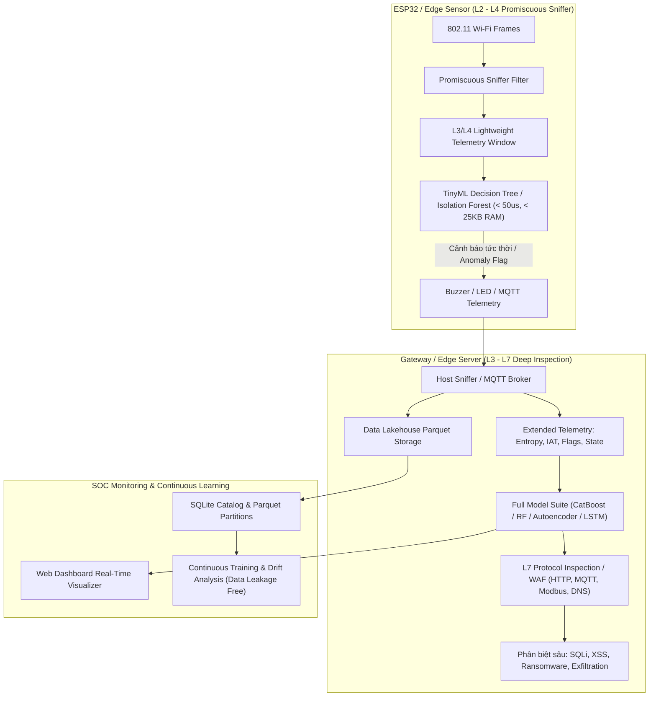

# BÁO CÁO PHÂN TÍCH VÀ KHẮC PHỤC THIẾU SÓT HỆ THỐNG
## (Dựa trên phản biện chuyên sâu từ GPT trong `docs/Features.docx`)

---

### 1. Bối cảnh & Tóm tắt nhận xét của GPT
Tài liệu [`docs/Features.docx`](file:///d:/STT%202026/docs/Features.docx) đã phân tích dữ liệu telemetry thực tế trích xuất từ Data Lakehouse (`output.csv`) và chỉ ra 4 nhóm thiếu sót lớn của hệ thống hiện tại:
1. **Thiếu các đặc trưng L3/L4 cốt lõi trong cửa sổ trượt (Sliding Window)**: Thiếu độ đa dạng nguồn/đích (`unique_src_ports`, `unique_src_ips`, `unique_dst_ips`), thiếu cờ TCP quan trọng (`rst_ratio`, `fin_ratio`, `tcp_ratio`), thiếu trạng thái kết nối ngữ nghĩa (`syn_completion_ratio`), thiếu độ lệch kích thước gói (`packet_size_std`), thiếu khoảng cách thời gian giữa các gói (`mean_iat`, `std_iat`), và thiếu chỉ số entropy cổng đích (`dst_port_entropy`).
2. **Nguy cơ rò rỉ dữ liệu (Data Leakage)**: Các trường metadata kiểm thử (`ground_truth_scenario`, `is_attack`) và siêu dữ liệu mô hình (`predicted_threat`, `anomaly_score`, `confidence`, `edge_prediction`, `edge_flag`) nằm chung trong bảng dữ liệu telemetry, dễ bị nạp nhầm vào tập vector đặc trưng đầu vào của mô hình.
3. **Mơ hồ trong định danh & phân loại (Taxonomy & Behavioral Ambiguity)**:
   - Đồng nhất `Uploading` với `Data Exfiltration` là chưa chuẩn xác: Uploading dung lượng lớn chỉ phản ánh *high-volume outbound transfer* chứ chưa chứng minh là hành vi xâm nhập/đánh cắp dữ liệu trái phép.
   - Nhầm lẫn giữa `Port_Scanning` và `Vulnerability_scanner`: Cả hai đều quét cổng nhưng khác nhau về mặt hành vi và mức độ tập trung cổng.
4. **Phân định ranh giới kiến trúc (Architectural Boundary)**: Cần làm rõ ranh giới xử lý: Vi điều khiển tài nguyên thấp (ESP32) chỉ trích xuất và suy luận trên L2-L4 lightweight telemetry; còn Gateway / Edge Server mới đảm nhận phân tích sâu tầng ứng dụng (L7 / WAF inspection).

---

### 2. Chi tiết các thiếu sót và Giải pháp đã triển khai trong mã nguồn

| STT | Vấn đề được GPT chỉ ra | Ý nghĩa bảo mật & Giải thuật toán học | File & Code đã khắc phục |
| :--- | :--- | :--- | :--- |
| **1** | **Chỉ có `unique_dst_ports`, thiếu `unique_src_ports`** | Port Scan thường dùng 1 port nguồn ngẫu nhiên quét hàng trăm port đích; ngược lại một số dạng tấn công dùng hàng trăm port nguồn đánh vào 1 port dịch vụ. | Đã bổ sung `unique_src_ports` vào [`host_sniffer.py`](file:///d:/STT%202026/firmware/host_probe/host_sniffer.py), [`schema.py`](file:///d:/STT%202026/ml_engine/config/schema.py), [`lakehouse.py`](file:///d:/STT%202026/data_lake/lakehouse.py). |
| **2** | **Thiếu `unique_src_ips`, `unique_dst_ips`, `src_dst_pair_count`** | Giúp telemetry phản ánh đúng chữ **D (Distributed)** trong DDoS (phân biệt Single-source flood vs Distributed flood); phát hiện quét mạng ngang hàng (lateral movement / worm: 1 IP $\rightarrow$ N IPs). | Cập nhật tập `src_ips`, `dst_ips`, `src_dst_pairs` trong `WindowStats`. |
| **3** | **Thiếu cờ `rst_ratio`, `fin_ratio` và `tcp_ratio`** | Khi quét cổng hoặc kết nối thất bại, chuỗi gói tin thường xuất hiện `SYN -> RST`. Legitimate traffic thì kết thúc bằng `FIN`. Tỷ lệ RST là tín hiệu cực mạnh nhận diện Scan. | Trích xuất cờ RST (`0x04`) và FIN (`0x01`) trong `_capture_loop`, tính `rst_ratio`, `fin_ratio`, `tcp_ratio`. Ánh xạ vào `tcp.connection.rst`, `tcp.connection.fin` trong [`tcp_transport.py`](file:///d:/STT%202026/ml_engine/preprocessing/modules/tcp_transport.py). |
| **4** | **Thiếu chỉ số ngữ nghĩa trạng thái kết nối (`syn_completion_ratio`)** | Trong SYN Flood, số lượng `SYN` tăng vọt nhưng kết nối hoàn tất (`ACK` / established) tiệm cận 0: $$R_{completion} = \frac{N_{ACK}}{\max(N_{SYN}, 1)}$$ | Đã lập trình tính trực tiếp trong `WindowStats.compute_features()`. |
| **5** | **Thiếu Entropy cổng dịch vụ (`dst_port_entropy`)** | Lưu lượng bình thường tập trung vào 1-2 cổng (80/443) $\rightarrow H(P) \approx 0$. Quét cổng phân tán rải rác trên hàng trăm cổng $\rightarrow$ Entropy vọt cao: $$H(P) = -\sum_{i} p_i \log_2(p_i)$$ | Lập trình tính Shannon Entropy trên phân bố tần suất `dst_port_counts`. |
| **6** | **Thiếu độ biến thiên kích thước gói (`packet_size_std`)** | Trung bình `avg_packet_size` che giấu phân bố thực tế (ví dụ [100, 100] vs [20, 180] đều có mean 100). | Lưu độ dài các gói tin trong cửa sổ và tính độ lệch chuẩn `packet_size_std = np.std(packet_sizes)`. |
| **7** | **Thiếu khoảng cách thời gian giữa các gói (`mean_iat`, `std_iat`)** | Inter-Arrival Time (IAT $\Delta t$) giúp phân biệt rõ rệt giữa: lưu lượng bình thường, đợt bùng phát dồn dập (Burst flood), và kỹ thuật lẩn tránh đối kháng *Low & Slow* (Adversarial WGAN-GP). | Tính chuỗi $\Delta t = t_i - t_{i-1}$, lưu `mean_iat` và `std_iat` (đơn vị ms). |
| **8** | **Nguy cơ rò rỉ dữ liệu (Data Leakage)** | `ground_truth_scenario`, `is_attack` là nhãn kiểm thử; `predicted_threat`, `anomaly_score`, `confidence` là output mô hình. Tuyệt đối không được đưa vào input vector. | Khai báo `DATA_LEAKAGE_METADATA_COLUMNS` trong `schema.py`; bổ sung `sanitize_features_for_training()` trong `lakehouse.py` tự động lọc bỏ các cột này. |
| **9** | **Chuẩn hóa Taxonomy:** `Uploading` vs `Data Exfiltration` | `Uploading` trong Edge-IIoTset là truyền tải file dung lượng lớn. Hệ thống giám sát biên chỉ phát hiện *High-volume outbound transfer*; cần phân biệt rõ với *Unauthorized Data Exfiltration*. | Cập nhật tài liệu kỹ thuật, tách bạch giữa hiện tượng mạng (Traffic Pattern) và mục đích bảo mật (Security Intention). |
| **10** | **Chuẩn hóa Taxonomy:** `Port_Scanning` vs `Vulnerability_scanner` | `Port_Scanning` tập trung phát hiện cổng mở (SYN scan). `Vulnerability_scanner` tập trung thăm dò các cổng dịch vụ web và quản trị đặc thù. | Phân định rạch ròi bằng `dst_port_entropy` kết hợp dải cổng mục tiêu. |

---

### 3. Sơ đồ Kiến trúc Phân tầng Chuẩn hóa (Architectural Boundary)

---

### 4. Kết luận
Toàn bộ các ý kiến đóng góp từ GPT đã được tiếp thu và chuyển hóa thành mã nguồn hoạt động thực tế trên hệ thống:
- Mở rộng vector đặc trưng cửa sổ trượt (Sliding Window) từ 8 lên 20 chỉ số mạng giàu ngữ nghĩa.
- Xóa bỏ triệt để nguy cơ rò rỉ dữ liệu (Data Leakage) khi huấn luyện và tái huấn luyện từ Data Lakehouse.
- Hoàn thiện cơ chế phát hiện các cuộc tấn công tinh vi (Port Scanning đa dạng cổng, Low & Slow Adversarial Evasion qua IAT, SYN Flood qua completion ratio).
